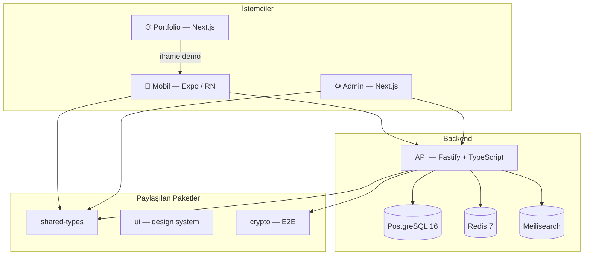

# UniCampus

**Üniversite öğrencilerine özel sosyal medya ve kariyer platformu.**

`.edu` mail doğrulamalı kampüs ağı; Instagram tarzı sosyal akış, Discord tarzı topluluklar ve LinkedIn tarzı kariyer evreni — tek uygulamada, ama sosyal ve kariyer içerikleri **birbirine karışmadan**.

---

## Canlı Demo

| Ortam | URL | Açıklama |
|-------|-----|----------|
| **Portfolio** | [portfolio-six-olive-acyde5gzlr.vercel.app](https://portfolio-six-olive-acyde5gzlr.vercel.app) | Landing page + telefon emülatöründe canlı demo |
| **Tam ekran demo** | [portfolio-six-olive-acyde5gzlr.vercel.app/try](https://portfolio-six-olive-acyde5gzlr.vercel.app/try) | Mobilde doğrudan uygulama deneyimi |
| **Uygulama (web)** | [unicampus-app-wine.vercel.app](https://unicampus-app-wine.vercel.app) | Expo web build — mock veriyle çalışır |

> Demo modunda gerçek API yerine yerleşik mock backend kullanılır. Giriş yapmadan akış, profil, topluluklar ve keşfet ekranları denenebilir.

---

## Özellikler

### Sosyal
- Ana akış (gönderi, beğeni, yorum, kaydet)
- Hikayeler ve reels
- Anket, etkinlik, milestone paylaşımı
- Takip / bağlantı isteği / yakın arkadaşlar
- Bildirimler ve DM (mock)

### Topluluklar
- Discord tarzı kanallar
- Kulüp ve takım profilleri
- Üyelik rolleri, davet linki, katılım ayarları
- Topluluk oluşturma ve üye yönetimi

### Kariyer
- Proje, staj fırsatı, milestone kartları
- Ayrı kariyer evreni (sosyal akıştan izole tasarım)
- Akademik profil bilgileri

### Platform
- Açık/kapalı hesap, gizlilik ayarları
- Keşfet: kullanıcı, etiket, etkinlik araması
- Kampüs indirimleri (deals)
- Admin paneli: kullanıcı, reklam, analitik yönetimi

---

## Mimari



---

## Monorepo Yapısı

```
unicampus/
├── apps/
│   ├── mobile/          # React Native (Expo SDK 52) — öğrenci uygulaması
│   ├── portfolio/       # Next.js 15 — landing + canlı demo sitesi
│   ├── admin/           # Next.js 15 — yönetim paneli
│   └── api/             # Fastify — REST API + WebSocket
├── packages/
│   ├── shared-types/    # Ortak TypeScript tipleri ve Zod şemaları
│   ├── ui/              # Design system (tema, spacing, typography)
│   └── crypto/          # Uçtan uca şifreleme wrapper
├── supabase/            # Migration, RLS, Edge Functions
├── infra/               # Docker Compose (PostgreSQL, Redis, Meilisearch)
├── docs/                # Ürün, mimari ve teknik dokümantasyon
└── scripts/             # Yardımcı scriptler (smoke test vb.)
```

### Uygulamalar

| Uygulama | Teknoloji | Port (lokal) | Açıklama |
|----------|-----------|--------------|----------|
| `mobile` | Expo 52, React Native, Expo Router | `8081` (web) | iOS / Android / Web |
| `portfolio` | Next.js 15, Tailwind CSS | `3001` | Ürün tanıtım + emülatör |
| `admin` | Next.js 15, Tailwind CSS | `3000` | Moderasyon, reklam, analitik |
| `api` | Fastify, Drizzle ORM, BullMQ | `4000` | REST + WS backend |

### Paylaşılan Paketler

| Paket | İçerik |
|-------|--------|
| `@unicampus/shared-types` | Entity tipleri, API request/response şemaları |
| `@unicampus/ui` | `lightTheme` / `darkTheme`, spacing, radius, typography |
| `@unicampus/crypto` | Signal protokolü wrapper (E2E DM için) |

---

## Teknoloji Stack

| Katman | Teknoloji |
|--------|-----------|
| Mobil | React Native 0.76, Expo SDK 52, Expo Router, TanStack Query, Zustand |
| Web (demo) | React Native Web, Metro bundler |
| Portfolio / Admin | Next.js 15, Tailwind CSS, TypeScript |
| API | Node.js 20, Fastify 4, Drizzle ORM, Zod |
| Veritabanı | PostgreSQL 16 (partitioning, RLS) |
| Cache / Queue | Redis 7, BullMQ |
| Arama | Meilisearch |
| Auth | Supabase Auth + custom OTP |
| Monorepo | npm workspaces + Turborepo |
| Deploy | Vercel (portfolio + mobile web), EAS (mobil native, planlı) |

---

## Gereksinimler

| Araç | Sürüm |
|------|-------|
| Node.js | ≥ 20 LTS |
| npm | ≥ 10 |
| Docker + Docker Compose | güncel (API geliştirme için) |
| Expo Go veya iOS/Android simulator | mobil geliştirme için |

---

## Kurulum

### 1. Repoyu klonla

```bash
git clone https://github.com/YusufAlper17/UniCampus.git
cd UniCampus
```

### 2. Bağımlılıkları kur

```bash
npm install
```

### 3. Ortam değişkenleri

```bash
cp .env.example .env
# .env dosyasını düzenle — özellikle DATABASE_URL, JWT secret'ları
```

### 4. Yerel altyapı (API geliştirme)

```bash
npm run infra:up
# PostgreSQL :5432 | Redis :6379 | Meilisearch :7700

npm run db:migrate
npm run db:seed
```

### 5. Uygulamaları başlat

```bash
# API
npm run dev --workspace=apps/api
# → http://localhost:4000

# Admin panel
npm run dev --workspace=apps/admin
# → http://localhost:3000

# Mobil (Expo)
npm run start --workspace=apps/mobile
# → QR kod / simulator

# Mobil web (tarayıcı)
npm run web --workspace=apps/mobile
# → http://localhost:8081

# Portfolio sitesi
npm run portfolio:dev
# → http://localhost:3001
```

---

## Mock Demo Modu

Mobil uygulama şu an `USE_MOCK = true` ile çalışır (`apps/mobile/src/lib/api.ts`). Bu modda:

- Gerçek API'ye istek gitmez
- 30+ mock kullanıcı, gönderi, topluluk ve mesaj verisi kullanılır
- Web'de `SecureStore` yerine `localStorage` kullanılır
- `?demo=1&theme=light` query parametreleri demo/portfolio için light tema zorlar

Portfolio emülatörü iframe ile mobil web uygulamasını yükler:

```
{NEXT_PUBLIC_DEMO_APP_URL}?theme=light&demo=1
```

---

## Mobil Ekranlar

<details>
<summary><strong>43+ ekran — tıklayarak listele</strong></summary>

**Auth:** welcome, login, register

**Tabs:** akış, keşfet, oluştur, topluluklar, profil, aktivite

**Sosyal:** gönderi detay, hashtag, reels, hikaye görüntüle/oluştur

**Compose:** anket, etkinlik, proje, milestone, fırsat

**Topluluk:** detay, kanal, üyeler, oluştur

**Profil:** kullanıcı profili, profil düzenle, akademik bilgi, yakın arkadaşlar

**Mesajlaşma:** mesaj listesi, sohbet, bildirimler

**Ayarlar:** gizlilik, güvenlik, takip istekleri

**Kariyer:** proje detay, etkinlik katılımcıları, kampüs indirimleri

</details>

---

## Test

```bash
# Tüm workspace testleri
npm test

# Sadece API
npm test --workspace=apps/api

# Tip kontrolü
npm run typecheck

# Smoke test (API ayaktayken)
./scripts/smoke-test.sh
```

---

## Deploy (Vercel)

### Portfolio (`apps/portfolio`)

```bash
cd apps/portfolio
vercel --prod
```

**Environment variable:**

| Değişken | Değer |
|----------|-------|
| `NEXT_PUBLIC_DEMO_APP_URL` | `https://unicampus-app-wine.vercel.app` |

### Mobil Web (`apps/mobile`)

Monorepo kökünden:

```bash
vercel --prod --local-config apps/mobile/vercel.json
```

`expo export --platform web` ile static build üretilir; `frame-ancestors *` header'ı portfolio iframe embed'i için ayarlanmıştır.

### Production URL'leri

| Proje | URL |
|-------|-----|
| Portfolio | https://portfolio-six-olive-acyde5gzlr.vercel.app |
| Mobil Web | https://unicampus-app-wine.vercel.app |

---

## Ortam Değişkenleri

`.env.example` dosyası tüm değişkenlerin şablonunu içerir. Özet:

| Grup | Önemli değişkenler |
|------|-------------------|
| **API** | `DATABASE_URL`, `REDIS_URL`, `JWT_ACCESS_SECRET`, `MEILISEARCH_HOST` |
| **Mobile** | `EXPO_PUBLIC_API_URL`, `EXPO_PUBLIC_SUPABASE_URL` |
| **Admin** | `NEXT_PUBLIC_API_URL`, `ADMIN_SESSION_SECRET` |
| **Portfolio** | `NEXT_PUBLIC_DEMO_APP_URL` (Vercel'de ayarlanır) |

> Gizli değerler asla repoya commit edilmez.

---

## Dokümantasyon

Detaylı ürün ve mühendislik dokümanları [`docs/`](./docs/) altında:

| # | Doküman | Konu |
|---|---------|------|
| 01 | [Ürün Vizyonu](./docs/01-product-vision.md) | Problem, çözüm, North Star metrik |
| 02 | [Kullanıcı Akışları](./docs/02-user-flows.md) | Kayıt, paylaşım, mesajlaşma |
| 03 | [Sayfa Spec'leri](./docs/03-page-specs/) | Ekran bazlı davranış tanımları |
| 04 | [Veritabanı Şeması](./docs/04-database-schema.md) | Tablolar, partitioning, RLS |
| 05 | [API Sözleşmeleri](./docs/05-api-contracts.md) | REST endpoint'leri |
| 06 | [Teknoloji Stack](./docs/06-tech-stack.md) | Kurulum, env, mimari |
| 07 | [UI Wireframe'ler](./docs/07-ui-wireframes/) | Mobil + admin wireframe'ler |
| 08 | [Geliştirme Yol Haritası](./docs/08-development-roadmap.md) | 13 fazlık sprint planı |
| 09 | [Ölçeklenebilirlik](./docs/09-scalability-architecture.md) | Milyon kullanıcı mimarisi |
| 10 | [Admin & Monetizasyon](./docs/10-admin-monetization.md) | Reklam, sponsor, gelir |
| 11 | [Güvenlik](./docs/11-security-trust-safety.md) | E2E, KVKK, anti-abuse |
| 12 | [Design System](./docs/12-design-system.md) | Token'lar, komponentler |
| 13 | [Rekabetçi Özellikler](./docs/13-competitive-features.md) | Diferansiyatör matris |
| 14 | [Sosyal × Kariyer](./docs/14-social-career-product-design.md) | Dual feed tasarımı |
| 15 | [Üyelik & Topluluklar](./docs/15-membership-communities.md) | Görünürlük matrisi |

---

## Proje Durumu

| Alan | Durum |
|------|-------|
| Mobil UI (40+ ekran) | ✅ MVP demo hazır |
| Mock backend | ✅ Tam işlevsel |
| Portfolio + canlı demo | ✅ Vercel'de yayında |
| API (Fastify) | 🔄 Geliştirme aşamasında |
| Admin panel | 🔄 Temel sayfalar |
| Supabase Auth entegrasyonu | 📋 Planlandı |
| Native iOS/Android build (EAS) | 📋 Planlandı |
| Production API deploy | 📋 Planlandı |

---

## Katkı

Bu proje şu an özel (proprietary) geliştirme aşamasındadır. Dış katkılar için önce iletişime geçin.

---

## Lisans

Özel (proprietary). Tüm hakları saklıdır.

---

## İletişim

**Yusuf Alper İlhan** — [GitHub](https://github.com/YusufAlper17/UniCampus)
