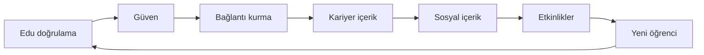

# 01 — Ürün Vizyonu

## Tek Cümle

UniCampus, üniversite öğrencisinin sosyal hayatını (Instagram) ve kariyer kimliğini (LinkedIn) tek uygulamada birleştiren — ama bu iki evreni asla birbirine karıştırmayan — `.edu` doğrulamalı, kampüs odaklı bir sosyal platformdur.

## Problem

Üniversite öğrencisi bugün parçalı bir deneyim yaşıyor:

- **Instagram** sosyal ama gürültülü, kampüse özel değil, doğrulanmamış.
- **LinkedIn** profesyonel ama soğuk, öğrenciye göre değil, sosyal değil.
- **WhatsApp/Discord** mesajlaşma ve topluluk ama dağınık, keşfedilebilir değil.
- Kampüse özel etkinlik, kulüp, indirim bilgisi hiçbir yerde toplu değil.

Kimse "öğrenci kimliğini" güvenle doğrulamıyor; bu yüzden kampüs içi güven ve network effect oluşmuyor.

## Çözüm ve Değer Önerisi

1. **Doğrulanmış kampüs ağı** — `.edu` mail + OTP. Yalnızca gerçek öğrenciler.
2. **İki ayrı evren** — Sosyal akış ve Kariyer merkezi, kullanıcı kontrolünde, sıfır sızıntı.
3. **Hibrit sosyal graf** — Takip (Instagram) + Bağlantı (LinkedIn) bir arada.
4. **Kampüsün işletim sistemi** — Etkinlik, topluluk, kulüp/takım üyeliği, mesajlaşma, indirimler.

## Unicorn Tezi

Network effect motoru: Doğrulama güven yaratır → güven bağlantıyı artırır → bağlantı içeriği besler → içerik etkileşimi → etkileşim yeni kullanıcı çeker. Her üniversite kendi içinde yoğunlaşır (yerel network effect), sonra üniversiteler arası genişler.

## Hedef Kitle

| Segment | Açıklama | Birincil ihtiyaç |
|---------|----------|------------------|
| Öğrenci (birey) | Aktif üniversite öğrencisi | Sosyalleşme + kariyer görünürlüğü |
| Kulüp | Resmi/onaylı öğrenci kulübü | Etkinlik duyurusu, üye yönetimi |
| Takım | Spor/akademik takım | Kadro, maç/etkinlik duyurusu |
| Admin | Platform yöneticisi | Moderasyon, gelir, kullanıcı yönetimi |

Pilot: İTÜ veya ODTÜ (net domain listesi, güçlü kulüp ekosistemi). Sonra İstanbul/Ankara üniversiteleri, ardından ulusal.

## Kullanıcı Tipleri ve Yetkiler

| Tip | Özel yetkiler |
|-----|---------------|
| **Öğrenci** | Sosyal + kariyer paylaşım, etkinlik (bireysel), DM, topluluk kurma, indirim görüntüleme |
| **Kulüp** | Etkinlik, topluluk, üye yönetimi, katılım ayarları, çoklu admin, rozet |
| **Takım** | Etkinlik, kadro, pozisyon atama, katılım ayarları, maç duyurusu |
| **Admin** | Kullanıcı yönetimi, moderasyon, reklam, sponsor, gelir raporu |
| **Super Admin** | Rol atama, üniversite ekleme, sistem ayarları |

## Kapsam (MVP → Unicorn)

| Aşama | Kapsam |
|-------|--------|
| **MVP** | Auth, sosyal akış, açık/gizli hesap, takip + bağlantı isteği, paylaşım, etkinlik, DM, keşfet, dual profil |
| **V1** | Kariyer paylaşımı (proje/milestone/fırsat), anket, topluluk/kulüp/takım üyelik, akademik profil, admin paneli |
| **V2** | Story, sponsorluk, feed reklamları, E2E DM, gelişmiş kariyer filtreleri |
| **Scale** | Milyon kullanıcı mimarisi, otomatik moderasyon, gelir analitiği, Pro tier |

### Bilinçli Kapsam Dışı (şimdilik)

- Ders notu paylaşımı / not marketplace
- İnteraktif kampüs haritası (etkinlik konumu için metin adres + opsiyonel koordinat yeterli)

Bu kararlar odağı korumak içindir; sosyal + kariyer + topluluk üçlüsü çekirdektir.

## North Star Metrik

**WCE — Weekly Connections + Engagement:** Haftalık aktif kullanıcı başına kurulan bağlantı + üretilen/etkileşilen içerik. Bu metrik hem sosyal hem kariyer evreninin sağlığını tek sayıda birleştirir ve network effect'i doğrudan ölçer.

Destekleyici metrikler:

| Metrik | Hedef (pilot) |
|--------|---------------|
| Edu doğrulama tamamlama oranı | > %80 |
| D1 / D7 / D30 retention | %50 / %30 / %20 |
| Haftalık paylaşım/kullanıcı | > 2 |
| Bağlantı kabul oranı | > %60 |
| Etkinlik katılım dönüşümü | > %15 |

## Rekabet Konumlandırması

| Rakip | Onların gücü | UniCampus farkı |
|-------|--------------|------------------|
| Instagram | Sosyal akış, story | Edu doğrulama, kampüs izolasyonu, kariyer evreni |
| LinkedIn | Profesyonel ağ | Öğrenciye özel, sosyal evren, sıcak kampüs bağı |
| Discord | Topluluk/kanal | Keşfedilebilirlik, etkinlik, dual feed entegrasyonu |
| WhatsApp | Mesajlaşma | Topluluk organizasyonu, kampüs keşfi |

**Ana silah:** Genel sosyal ağda devlerle yarışmıyoruz; "öğrencinin işletim sistemi" olarak kampüste kazanıyoruz. Dual evren + edu güven + kampüs ağı kombinasyonu kopyalanması zor bir moat.

## Monetizasyon (Özet)

1. **Feed reklamları** — Instagram tarzı native sponsorlu postlar (yalnızca sosyal akışta).
2. **İndirimler & Kampanyalar** — Sponsor anlaşmaları, öğrenci indirim kodları.
3. **Pro tier (gelecek)** — UniCampus Pro (öğrenci), Kulüp Pro (kurum).

Detay: [10 — Admin & Monetizasyon](./10-admin-monetization.md).

## Başarı Tanımı

Bir üniversitede öğrencilerin günlük olarak "önce UniCampus'a bakdığı" noktaya gelmek: etkinlikler, kampüs gündemi, kulüp duyuruları, kariyer fırsatları ve arkadaş içeriği için tek varış noktası olmak. Pilot üniversitede %40+ aktif öğrenci penetrasyonu, sürdürülebilir WCE büyümesi.
