# 02 — Kullanıcı Akışları

Bu doküman uçtan uca kullanıcı senaryolarını ve sistem etkileşimlerini tanımlar. Her akış mobil istemci, API, veritabanı ve dış servisler arasındaki ilişkiyi gösterir.

## Navigasyon Haritası

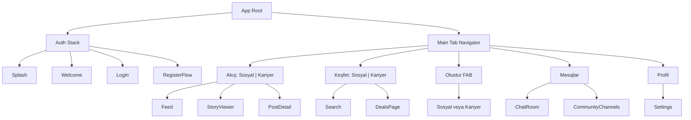

## 1. Kayıt → İlk Paylaşım

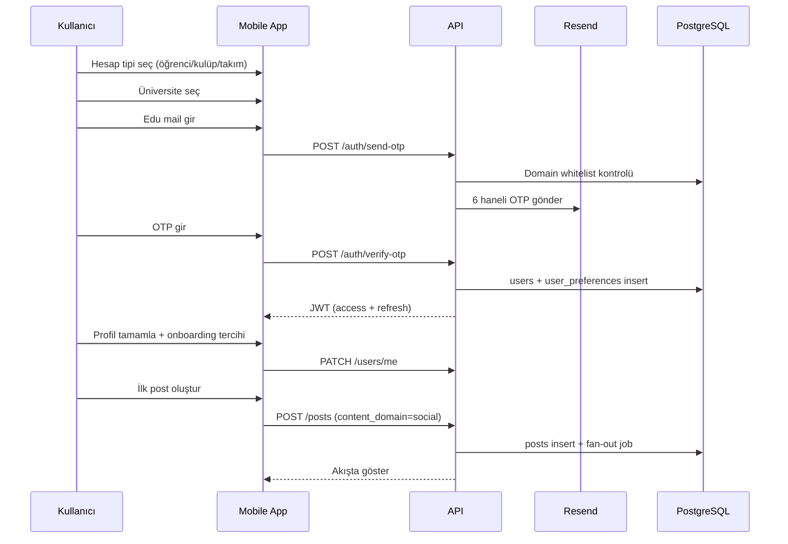

Kritik kurallar:
- Domain whitelist'te olmayan mail → "Bu mail {üniversite}'ye ait değil" hatası.
- OTP 10 dk geçerli, 3 deneme; 60 sn yeniden gönderim rate limit.
- Onboarding tercihi (`Sosyal / Kariyer / İkisi`) → `user_preferences.default_feed_tab`.

## 2. Giriş (Login)

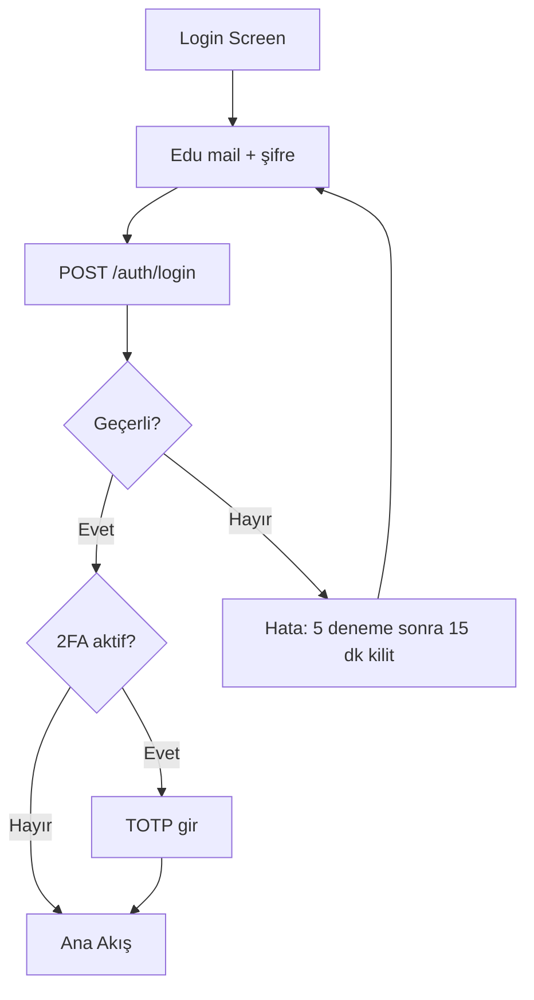

## 3. Dual Feed Görüntüleme

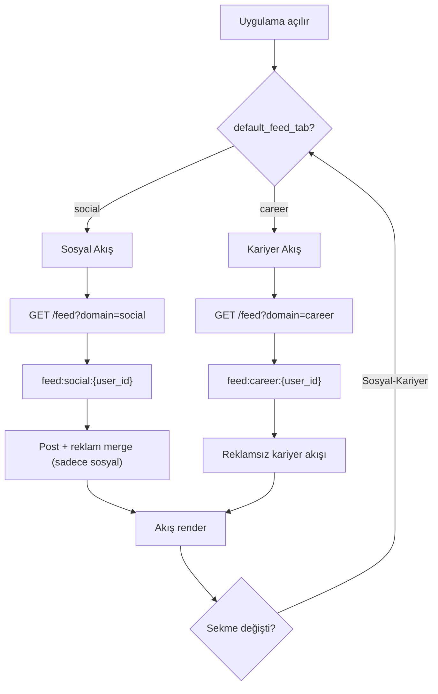

Altın kural: `domain=social` sorgusu `content_domain=career` post döndürmez ve tersi. SQL ve Redis seviyesinde garanti.

## 4. İçerik Oluşturma (Evren Seçimi)

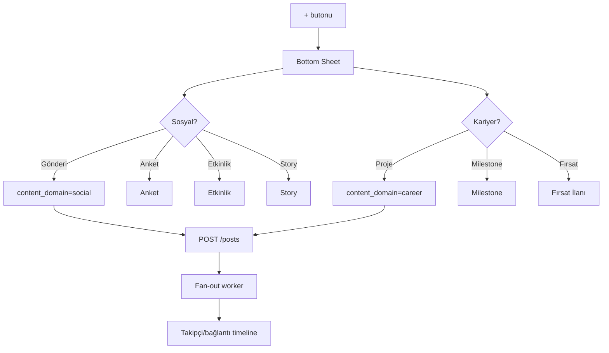

## 5. Takip ve Bağlantı (Sosyal Graf)

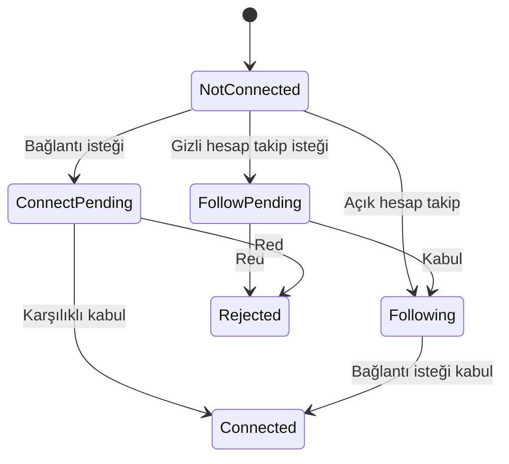

İki bağımsız ilişki: Takip (tek yönlü) ve Bağlantı (karşılıklı). Bir kullanıcı hem takipçi hem bağlantı olabilir.

## 6. Etkinliğe Katılım

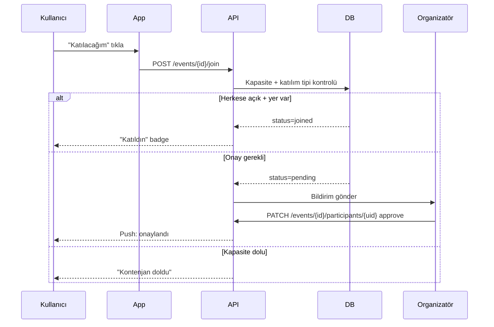

## 7. Topluluk/Kulüp/Takım Katılımı

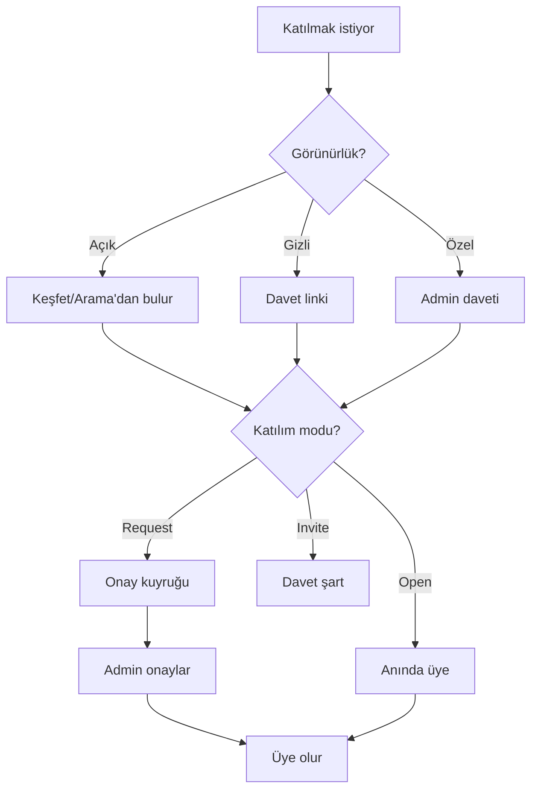

Detay: [15 — Üyelik & Topluluklar](./15-membership-communities.md).

## 8. Mesajlaşma (Realtime)

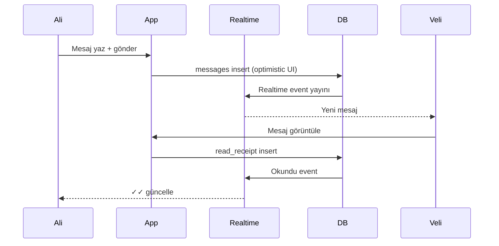

## 9. Monetizasyon — Reklam Gösterimi

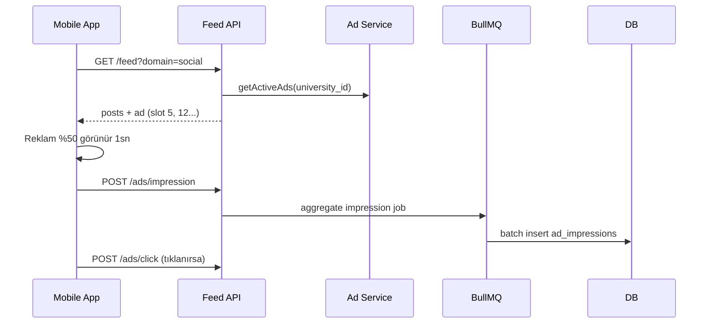

## 10. Monetizasyon — İndirim Kodu Alma

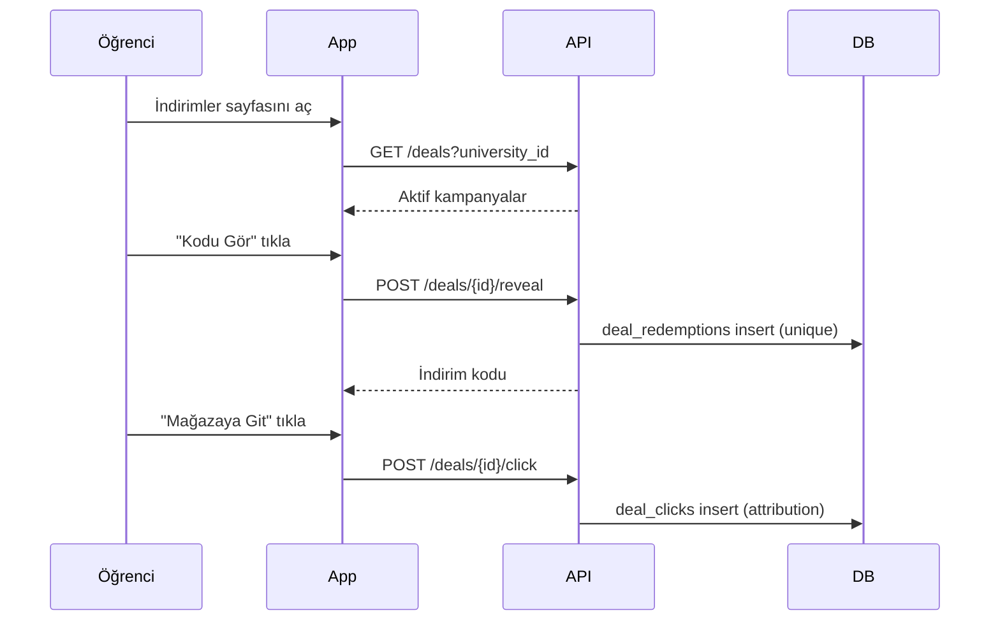

## 11. Şikayet ve Moderasyon

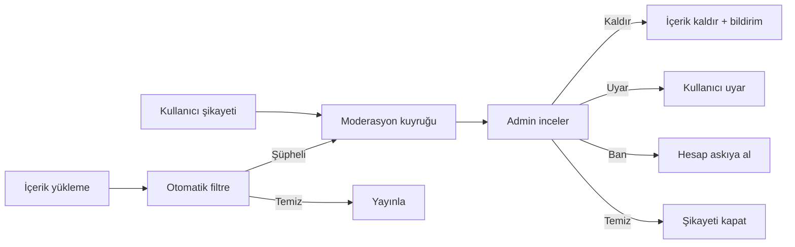

## Hata ve Boş Durum Akışları

| Durum | Davranış |
|-------|----------|
| Ağ yok | Cache'lenmiş feed göster + "çevrimdışı" banner; aksiyonlar kuyruğa alınır |
| Boş feed | Curated starter content + "5 kulüp takip et" önerisi |
| OTP süresi doldu | "Kod süresi doldu, yeniden gönder" |
| Kapasite dolu (etkinlik) | "Kontenjan doldu" + bekleme listesi (V2) |
| Yetkisiz erişim | 403 → "Bu içeriğe erişim yetkin yok" |
