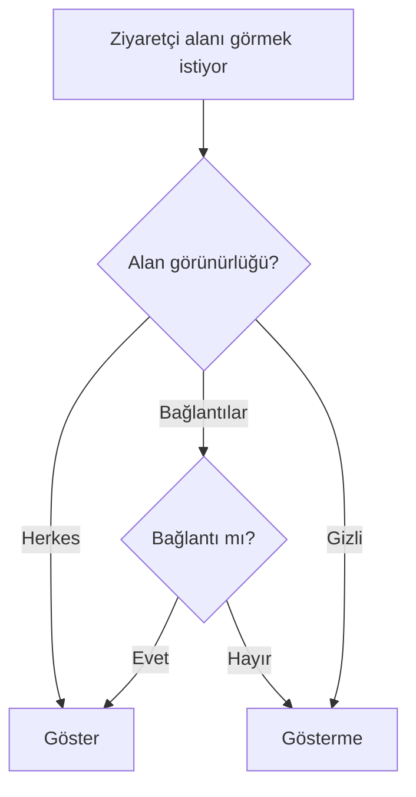

# Sayfa Spec — Akademik Profil

Üniversiteye özel bilgiler + alan bazlı gizlilik. İlgili kod: `apps/mobile/src/features/profile/academic/`, tablo `user_academic_info`.

## Alanlar ve Varsayılan Görünürlük

| Alan | Tip | Varsayılan |
|------|-----|-----------|
| Fakülte | enum/text | Herkes |
| Bölüm | enum/text | Herkes |
| Sınıf | 1–5+/Mezun | Herkes |
| GPA | decimal (0–4) | Sadece bağlantılar |
| Öğrenci no | text | Gizli |
| Mezuniyet yılı | year | Herkes |
| Dönem | text | Bağlantılar |

## Alan Bazlı Görünürlük

Her alan bağımsız: **Herkes / Bağlantılar / Gizli**.

```
Akademik Bilgiler (düzenle)
Fakülte: Mühendislik     [Herkes ▼]
Bölüm:   Bilgisayar Müh. [Herkes ▼]
Sınıf:   3               [Herkes ▼]
GPA:     3.42            [Bağlantılar ▼]
Öğr.No:  150150001       [Gizli ▼]
```

## Görünürlük Çözümleme



## Kurallar

- GPA, öğrenci no gibi hassas alanlar varsayılan kapalı (privacy-by-default).
- Görünürlük JSON olarak `user_academic_info.visibility` alanında saklanır.
- Sahibi her zaman tüm alanları görür.
- Gizli hesapta tüm akademik alanlar takipçi olmayanlardan gizli.
- Veri minimizasyonu: öğrenci no asla başka kullanıcıya API'de dönmez (Gizli zorunlu varsayılan).

## API

| Aksiyon | Endpoint |
|---------|----------|
| Akademik getir | `GET /users/{id}/academic` (görünürlük filtreli) |
| Akademik güncelle | `PATCH /users/me/academic` |
