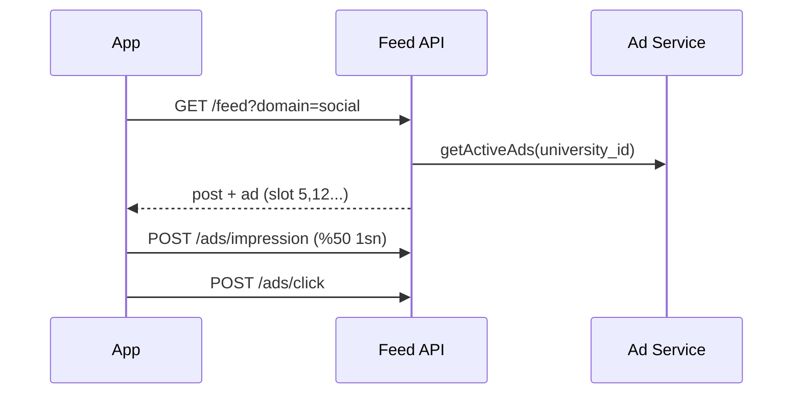

# Admin Spec — Feed Reklam Yönetimi

Instagram tarzı native reklam. Yalnızca sosyal akışta. İlgili kod: `apps/admin/src/app/(dashboard)/ads/`.

## Liste

```
Feed Reklamları  [+ Yeni Reklam]
Starbucks Yaz | Aktif | 45K gösterim | 1.2K tık
  CTR %2.7 | Harcama ₺12.400 | [Düzenle][Duraklat]
Teknosa BTS | Taslak | — | —
  [Yayınla][Düzenle]
```

## Reklam Formu

| Alan | Kural |
|------|-------|
| Sponsor | dropdown |
| Format | Görsel+metin / Video (V2) / Carousel (V2) |
| Medya | 1080x1080 veya 1080x1350 |
| Başlık, açıklama | text |
| CTA metni | "Daha Fazla Bilgi", "Hemen Al"... |
| Hedef URL | landing / deal detay |
| Hedefleme | üniversite, bölüm, sınıf |
| Feed pozisyonu | her N post (varsayılan 5) |
| Bütçe | toplam gösterim/tıklama, günlük limit |
| Başlangıç/bitiş, durum | date, enum |

## Reklam Servis Akışı



## API

| Aksiyon | Endpoint |
|---------|----------|
| Liste | `GET /admin/ads` |
| Oluştur | `POST /admin/ads` |
| Yayınla/duraklat | `PATCH /admin/ads/{id}` |
| Performans | `GET /admin/ads/{id}/stats` |

## Kurallar

- Reklam yalnızca sosyal akışta — kariyer akışında asla.
- Max 1 reklam / 5 post.
- Idempotent impression/click (gelir hatası önleme).
- "Sponsorlu" etiketi mobilde zorunlu.
