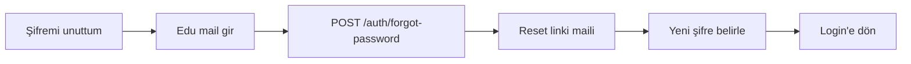

# Sayfa Spec — Kimlik Doğrulama (Auth)

Kapsam: Splash, Welcome, Login, Register (4 adım), şifre sıfırlama. İlgili kod: `apps/mobile/src/features/auth/`, `apps/api/src/routes/auth.ts`.

## Splash Screen

| Öğe | Davranış |
|-----|----------|
| Amaç | Marka + oturum kontrolü |
| Logic | Geçerli token varsa → Main Tabs; yoksa → Welcome |
| Süre | Max 2 sn (token doğrulama paralel) |
| Hata | Token geçersiz/expired → refresh dene → başarısızsa Welcome |

## Welcome

| Element | Tıklama | Sonuç |
|---------|---------|-------|
| Giriş Yap | Navigate | Login |
| Kayıt Ol | Navigate | Register Adım 1 |
| Alt link | Navigate | Login |

## Login

Alanlar: edu mail, şifre.

| Aksiyon | API | Sonuç |
|---------|-----|-------|
| Giriş | `POST /auth/login` | Başarı → token; 2FA aktifse TOTP ekranı |
| Şifremi unuttum | `POST /auth/forgot-password` | Reset maili |
| Hatalı giriş | — | 5 deneme → 15 dk kilit (rate limit) |

Doğrulama: email format + edu domain hint; şifre min 8 karakter.

## Register — Adım 1: Hesap Tipi

Tek seçim kart UI: Öğrenci / Kulüp / Takım.

- Kulüp/Takım seçilirse Adım 4'te ek alanlar (kurum adı, kategori, onay belgesi) açılır ve hesap `status=pending_approval` olur (admin onayı).

## Register — Adım 2: Üniversite

- Arama kutusu → `GET /universities?q=` (Meilisearch / PG ilike).
- Seçim zorunlu; seçilen `university_id` sonraki adımda domain kontrolü için kullanılır.

## Register — Adım 3: Edu Mail + OTP

| Aksiyon | API | Kural |
|---------|-----|-------|
| Kod gönder | `POST /auth/send-otp` | Mail domain'i seçilen üniversitenin whitelist'inde olmalı |
| Domain hatalı | — | "Bu mail {üniversite}'ye ait değil" toast |
| Doğrula | `POST /auth/verify-otp` | 6 hane, 10 dk geçerli, 3 deneme |
| Tekrar gönder | `POST /auth/send-otp` | 60 sn cooldown |

OTP girişi: 6 haneli ayrı kutular, otomatik ilerleme, yapıştırma desteği.

## Register — Adım 4: Profil Oluşturma

**Öğrenci alanları:**
- Ad Soyad, kullanıcı adı (@, global unique), fakülte, bölüm, sınıf (1–5+/Mezun), profil fotoğrafı (ops.), bio, kariyer headline.
- Akademik (ops.): GPA, öğrenci no — her alan için görünürlük seçimi.
- Hesap tipi: Açık / Gizli (varsayılan açık).
- Onboarding sorusu: "Ne için kullanacaksın?" → Sosyal / Kariyer / İkisi → `default_feed_tab`.

**Kulüp alanları:** Kulüp adı, kullanıcı adı, kategori, açıklama, logo, yönetici adı, onay belgesi.

**Takım alanları:** Takım adı, branş, açıklama, logo.

Bitir → `POST /users/register` → Main Tabs + 3 adımlı guided tour.

## Şifre Sıfırlama

## Durum ve Hata Tablosu

| Durum | UI |
|-------|-----|
| Domain geçersiz | Inline hata + öneri |
| OTP yanlış | Kutular kırmızı + kalan deneme |
| OTP süresi doldu | "Yeniden gönder" aktif |
| Kullanıcı adı alınmış | Inline "bu kullanıcı adı dolu" + öneriler |
| Kulüp onay bekliyor | Kayıt sonrası "Hesabın incelemede" ekranı |

## Güvenlik Notları

- OTP `OTP_PEPPER` ile hash'lenip saklanır; düz metin tutulmaz.
- Refresh token rotation; access token 15 dk.
- 2FA opsiyonel (kulüp/takımda zorunlu) — detay [11 — Güvenlik](../11-security-trust-safety.md).
