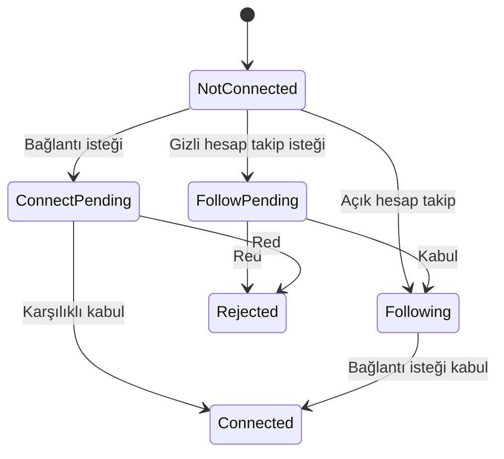

# Sayfa Spec — Takip ve Bağlantı (Sosyal Graf)

İki bağımsız ilişki tipi. İlgili kod: `apps/api/src/services/graph/`, `apps/mobile/src/features/profile/`.

## İlişki Modeli

| İlişki | Yön | Onay | Amaç |
|--------|-----|------|------|
| Takip (Follow) | Tek yönlü | Açık hesap: yok / Gizli: gerekir | İçerik tüketimi |
| Bağlantı (Connection) | Karşılıklı | Her zaman gerekir | Profesyonel ağ |
| Yakın Arkadaş | Tek yönlü liste | — | Story/post görünürlüğü |

## Durum Makinesi



## Profil Buton Matrisi

| Durum | Açık hesap | Gizli hesap |
|-------|-----------|-------------|
| İlişki yok | [Takip Et] + [Bağlantı Kur] | [Takip İsteği] + [Bağlantı İsteği] |
| Takip var | [Takip Ediliyor ▼] + [Bağlantı Kur] | Aynı |
| Bağlantı var | [Bağlantı ✓] + [Mesaj] | Aynı |

## API

| Aksiyon | Endpoint |
|---------|----------|
| Takip et | `POST /users/{id}/follow` |
| Takibi bırak | `DELETE /users/{id}/follow` |
| Takip isteği onay | `POST /follow-requests/{id}/accept` |
| Bağlantı isteği | `POST /connections/request` |
| Bağlantı onay | `POST /connections/{id}/accept` |
| Bağlantı kaldır | `DELETE /connections/{id}` |

## İstek Yönetimi Ekranı

```
Bildirimler → İstekler
├── Takip istekleri (gizli hesap)
│   @ali [Onayla] [Reddet]
└── Bağlantı istekleri
    @veli + "12 ortak bağlantı" [Kabul] [Reddet]
```

## Kurallar

- Takip rate limit: 100/gün (spam önleme).
- Engellenen kullanıcı takip/bağlantı kuramaz, profili göremez.
- Bağlantı karşılıklıdır: `connections(user_a_id, user_b_id)` UNIQUE pair, küçük id önce.
- Bağlantı sayısı profilde gösterilir; takipçi/takip ayrı sayaç.
