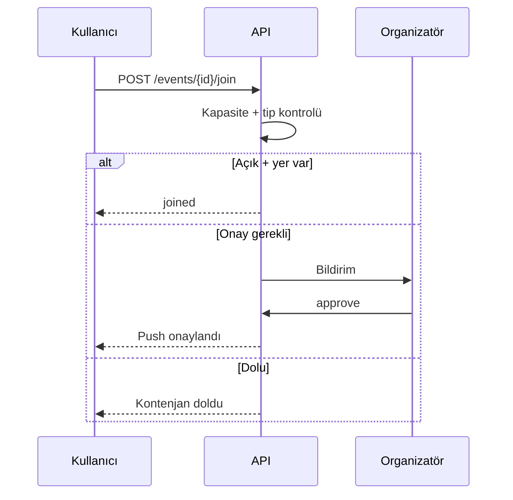

# Sayfa Spec — Etkinlik Oluşturma ve Detay

`content_domain=social` (neutral, sosyal akışta görünür). İlgili kod: `apps/mobile/src/features/events/`, `apps/api/src/services/events/`.

## Oluşturma Formu

| Alan | Kural |
|------|-------|
| Kapak fotoğrafı | Opsiyonel |
| Etkinlik adı | Zorunlu |
| Açıklama | Detaylı metin |
| Kapsam | Bireysel / Kulüp / Takım |
| Tarih + saat | Başlangıç zorunlu, bitiş opsiyonel |
| Konum | Metin adres + opsiyonel koordinat (full harita yok) |
| Kapasite | Sayı veya "Sınırsız" |
| Ücret | Ücretsiz / Ücretli (₺ tutar) |
| Katılım | Herkese açık / Onay gerekli / Sadece davetli |
| Görünürlük | Herkese açık / takipçiler |

`POST /events` → `events` + `posts(type=event)`.

## Etkinlik Kartı (Akışta)

Kapak, başlık, organizatör (@), tarih/saat, konum, katılımcı sayısı, ücret badge. CTA duruma göre değişir.

| Katılım tipi | Buton | Aksiyon |
|--------------|-------|---------|
| Herkese açık | Katılacağım | `event_participants` insert (joined) |
| Onay gerekli | Katılım İsteği Gönder | status=pending → organizatöre bildirim |
| Davetli | Davetli misin? | Davet/onay gerekir |
| Katıldı | Katıldın ✓ | İptal (etkinlikten 1 saat öncesine kadar) |

## Katılım Akışı

## Detay Sayfası

- Kapak, başlık, organizatör, tarih, konum, katılımcı sayısı, ücret.
- Katılımcı avatarları + sayı.
- Beğeni, yorum (post gibi).
- Aksiyonlar: Katıl, takvime ekle (.ics), paylaş.

## Ek Özellikler (planlanan)

- Etkinlik hatırlatma push (1 gün + 1 saat önce).
- Etkinlik sonrası "nasıldı?" anketi.
- QR check-in (V2).

## Limitler

| Kural | Değer |
|-------|-------|
| Kapasite | Sayı veya sınırsız |
| İptal | Etkinlikten 1 saat öncesine kadar |
| Davet kodu | Davetli etkinlikte gerekli |
