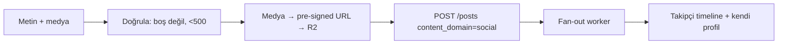

# Sayfa Spec — Gönderi Oluşturma (Sosyal)

`content_domain=social`. Threads + Instagram hibrit. İlgili kod: `apps/mobile/src/features/create/post/`.

## Giriş Noktası

Orta tab `+` → Bottom Sheet → "Sosyal" bölümünden "Gönderi".

## Form Alanları

| Alan | Kural |
|------|-------|
| Metin | Max 500 karakter, çok satırlı |
| Fotoğraf | 0–4 adet, carousel (V1) |
| Hashtag | `#kelime` otomatik parse → `post_hashtags` |
| Mention | `@kullanıcı` otomatik öneri + link |
| Topic | Sosyal topic seç (ops.) |
| Görünürlük | Herkese açık / Sadece takipçiler |

## Akış

## Davranışlar

- Medya client'ta sıkıştırılır, pre-signed URL ile direkt R2'ye yüklenir (API bypass).
- Optimistic: post anında kendi feed'inde "gönderiliyor" durumuyla görünür.
- Başarısız upload → retry + draft olarak kaydet (offline kuyruk).
- Yayın sonrası takipçilere push (rate-limit'li batch).

## Doğrulama ve Limitler

| Kural | Değer |
|-------|-------|
| Metin uzunluğu | ≤ 500 |
| Fotoğraf sayısı | ≤ 4 |
| Post rate limit | 10/saat, 50/gün |
| Yeni hesap (ilk 48s) | Link paylaşımı kısıtlı |
