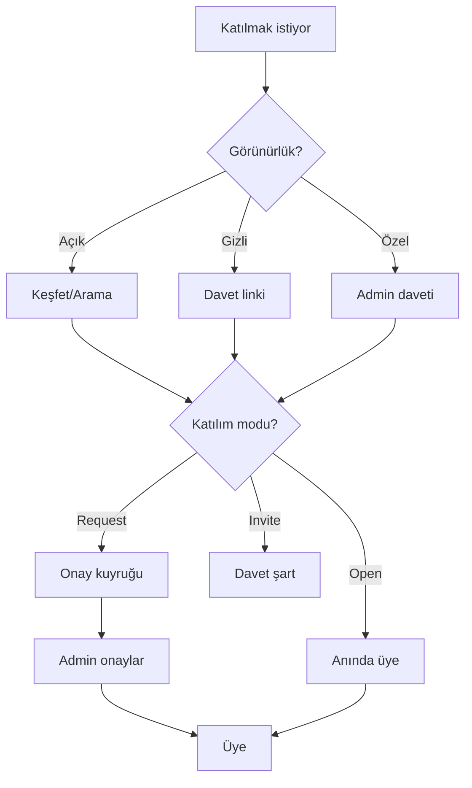

# Sayfa Spec — Üyelik (Kulüp / Takım / Topluluk)

Tek üyelik modeli; üç entity (kulüp, takım, topluluk) paylaşır. İlgili kod: `apps/api/src/services/community/membership.ts`.

## İki Bağımsız Ayar

### 1. Görünürlük

| Tip | Keşfet/Arama | Davet linki | Profilde |
|-----|-------------|-------------|----------|
| Açık (public) | Evet | Evet | Evet |
| Gizli (unlisted) | Hayır | Evet (tek yol) | Üye tercihi |
| Özel (private) | Hayır | Hayır (admin daveti) | Gizlenebilir |

### 2. Katılım Modu

| Mod | Davranış | Buton |
|-----|----------|-------|
| Open | Anında üye | [Katıl] |
| Request | Admin onayı | [Katılım İsteği Gönder] |
| Invite | Davet şart | [Davet Bekleniyor] |

## Katılım Akışı



## Davet Linki

```
Davet Linki Oluştur
unicampus.app/join/Xk9mP2nQ
Süre: [7 gün ▼]  Max kullanım: [50]
[Kopyala] [Paylaş] [İptal]
```

- Link → topluluk önizleme → katılım moduna göre Katıl/İstek.
- Admin yenileyebilir (eski link ölür).
- Gizli topluluklar search index'ine asla girmez.

## Admin Üye Yönetimi

```
Üye Yönetimi
Bekleyen istekler (5)
  @ali [Onayla][Red]
Üyeler (240)
  @ali — Admin
  @veli — Moderator [▼]
  @ayse — Üye [Çıkar]
Ayarlar: Görünürlük [Açık▼] Katılım [İstekle▼]
[Davet linki oluştur]
```

## Kulüp vs Takım Rolleri

| | Kulüp | Takım |
|---|-------|-------|
| Roller | Üye, Yönetici, Moderator | Oyuncu, Kaptan, Yedek, Koç |
| Profil | Üye listesi + rol | Kadro + pozisyon |

## API

| Aksiyon | Endpoint |
|---------|----------|
| Katıl/istek | `POST /communities/{id}/join` |
| İstek onay | `POST /communities/{id}/requests/{uid}/approve` |
| Davet linki | `POST /communities/{id}/invite-links` |
| Link ile katıl | `POST /join/{token}` |
| Rol değiştir | `PATCH /communities/{id}/members/{uid}` |
| Üye çıkar | `DELETE /communities/{id}/members/{uid}` |

Detay: [15 — Üyelik & Topluluklar](../15-membership-communities.md).
