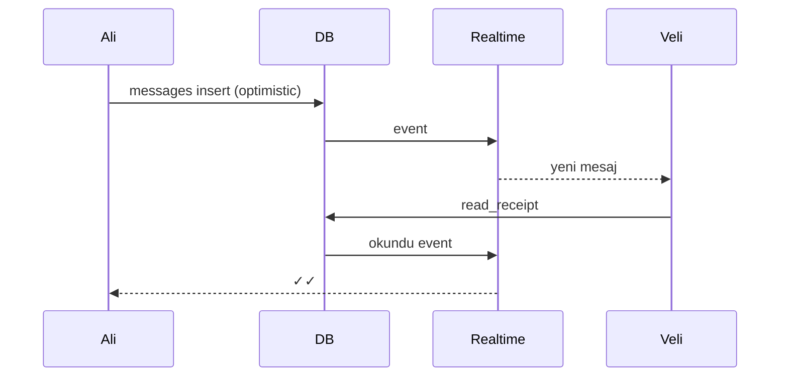

# Sayfa Spec — Mesajlaşma

WhatsApp seviyesi. İlgili kod: `apps/mobile/src/features/messages/`, `apps/api/src/services/chat/`, Supabase Realtime.

## Mesaj Listesi

```
Mesajlar  [✏️ yeni]
🔍 Ara
─ Topluluklar (Discord bölümü) ─
[UniCampus Genel] (3 yeni)
─ Sohbetler ─
○ Ali Yılmaz · son mesaj · 14:32
○ IEEE Kulübü · etkinlik daveti · dün
○ Grup: Final Çalışma · @veli: tamam
```

## 1:1 Chat Room

```
← ○ Ali Yılmaz  [📞][⋯]
[mesaj balonları, tarih ayraçları]
[📎][📷] Mesaj... [🎤][➤]
```

## Özellik Listesi

| Özellik | Uygulama |
|---------|----------|
| Metin mesaj | Realtime `messages` |
| Foto/video | Pre-signed URL → R2 + thumbnail |
| Sesli mesaj | expo-av kayıt → R2 |
| Dosya | PDF/doc ≤ 25MB |
| Yanıtla (reply) | `reply_to_id` |
| İlet (forward) | `forwarded_from` |
| Emoji tepki | `message_reactions` |
| Okundu (✓✓) | `read_receipts` |
| Yazıyor... | Realtime presence |
| Online/son görülme | Presence + `last_seen_at` |
| Sil (bende/herkeste) | Soft delete + `deleted_for_all` |
| Düzenle | 15 dk içinde, `edited_at` |
| Konum | Statik harita görseli + link |
| Post/etkinlik paylaş | Rich card (deep link) |
| Sessize al / Sabitle | User preference |
| Disappearing (V1) | 24s/7g/90g |
| View-once (V1) | Tek görüntüleme medya |

## Grup Sohbeti

- İsim, foto, üye listesi, admin rolleri.
- Üye ekle/çıkar, grup adı/foto: admin only.
- Max 256 üye (MVP).

## Realtime Akışı



## Güvenlik

- DM E2E şifreli (Signal Protocol, V1) — kilit ikonu + banner.
- Medya client-side encrypt → R2 şifreli blob.
- Detay: [11 — Güvenlik](../11-security-trust-safety.md).

## Performans

- Mesaj pagination: `messages(conversation_id, created_at DESC)` index, cursor-based.
- Presence: Redis Pub/Sub.
- Ölçek: Supabase Realtime → Centrifugo cluster (100K+ aktif).
