# 04 — Veritabanı Şeması

PostgreSQL 16. Birincil partition key: `university_id`. RLS ile üniversite izolasyonu. Bu doküman migration'ların (`supabase/migrations/`) ve `packages/shared-types` tiplerinin doğruluk kaynağıdır.

## ER Diyagramı

```mermaid
erDiagram
    universities ||--o{ university_domains : has
    universities ||--o{ users : belongs
    users ||--o{ user_academic_info : has
    users ||--o{ user_preferences : has
    users ||--o{ posts : creates
    users ||--o{ events : organizes
    users ||--o{ follows : follows
    users ||--o{ connections : connects
    users ||--o{ connection_requests : sends
    users ||--o{ career_projects : showcases
    posts ||--o{ comments : has
    posts ||--o{ likes : has
    posts ||--o{ bookmarks : saved
    posts ||--o{ post_hashtags : tagged
    hashtags ||--o{ post_hashtags : in
    events ||--o{ event_participants : has
    polls ||--o{ poll_options : has
    poll_options ||--o{ poll_votes : has
    conversations ||--o{ messages : contains
    conversations ||--o{ conversation_members : has
    messages ||--o{ message_reactions : has
    messages ||--o{ read_receipts : has
    communities ||--o{ community_channels : has
    communities ||--o{ community_members : has
    communities ||--o{ community_join_requests : queued
    communities ||--o{ community_invite_links : issues
    community_channels ||--o{ channel_messages : contains
    sponsors ||--o{ sponsor_contracts : has
    sponsors ||--o{ deals : offers
    sponsors ||--o{ ad_campaigns : runs
    deals ||--o{ deal_redemptions : tracked
    deals ||--o{ deal_clicks : tracked
    ad_campaigns ||--o{ ad_impressions : tracked
    ad_campaigns ||--o{ ad_clicks : tracked
    users ||--o{ notifications : receives
    users ||--o{ reports : files
    users ||--o{ admin_audit_log : acts
```



## Enum Tipleri

```sql
CREATE TYPE account_type      AS ENUM ('student', 'club', 'team', 'admin', 'super_admin');
CREATE TYPE account_status    AS ENUM ('active', 'pending_approval', 'suspended', 'banned', 'deleted');
CREATE TYPE account_visibility AS ENUM ('public', 'private');
CREATE TYPE content_domain    AS ENUM ('social', 'career');
CREATE TYPE post_type         AS ENUM ('post', 'poll', 'event', 'project', 'milestone', 'opportunity', 'lost_found');
CREATE TYPE visibility        AS ENUM ('public', 'followers', 'connections', 'private');
CREATE TYPE follow_status     AS ENUM ('active', 'pending');
CREATE TYPE request_status    AS ENUM ('pending', 'accepted', 'rejected');
CREATE TYPE event_scope       AS ENUM ('individual', 'club', 'team');
CREATE TYPE participation_type AS ENUM ('open', 'approval', 'invite');
CREATE TYPE participant_status AS ENUM ('joined', 'pending', 'invited', 'cancelled');
CREATE TYPE community_type     AS ENUM ('group', 'club_linked', 'team_linked');
CREATE TYPE community_visibility AS ENUM ('public', 'unlisted', 'private');
CREATE TYPE join_mode         AS ENUM ('open', 'request', 'invite');
CREATE TYPE member_role        AS ENUM ('owner', 'admin', 'moderator', 'member');
CREATE TYPE member_status      AS ENUM ('active', 'pending', 'banned');
CREATE TYPE conversation_type  AS ENUM ('dm', 'group');
CREATE TYPE contract_type      AS ENUM ('cpa', 'cpc', 'fixed', 'hybrid');
CREATE TYPE entity_status      AS ENUM ('draft', 'active', 'paused', 'ended');
CREATE TYPE report_status      AS ENUM ('open', 'reviewing', 'resolved', 'dismissed');
```

## Çekirdek Tablolar

### universities & domains

```sql
CREATE TABLE universities (
    id          UUID PRIMARY KEY DEFAULT gen_random_uuid(),
    name        TEXT NOT NULL,
    short_name  TEXT,
    city        TEXT,
    logo_url    TEXT,
    created_at  TIMESTAMPTZ NOT NULL DEFAULT now()
);

CREATE TABLE university_domains (
    id            UUID PRIMARY KEY DEFAULT gen_random_uuid(),
    university_id UUID NOT NULL REFERENCES universities(id) ON DELETE CASCADE,
    domain        TEXT NOT NULL UNIQUE,   -- 'itu.edu.tr', 'std.metu.edu.tr'
    created_at    TIMESTAMPTZ NOT NULL DEFAULT now()
);
CREATE INDEX idx_university_domains_domain ON university_domains(domain);
```

### users

```sql
CREATE TABLE users (
    id                 UUID PRIMARY KEY DEFAULT gen_random_uuid(),
    university_id      UUID NOT NULL REFERENCES universities(id),
    type               account_type NOT NULL DEFAULT 'student',
    status             account_status NOT NULL DEFAULT 'active',
    username           CITEXT NOT NULL UNIQUE,     -- global unique, case-insensitive
    display_name       TEXT NOT NULL,
    email_enc          BYTEA NOT NULL,             -- AES-256 application-level
    avatar_url         TEXT,
    bio                TEXT,
    career_headline    TEXT,
    account_visibility account_visibility NOT NULL DEFAULT 'public',
    career_visibility  visibility NOT NULL DEFAULT 'public',
    is_verified_student BOOLEAN NOT NULL DEFAULT false,  -- edu doğrulama tik
    is_verified_org     BOOLEAN NOT NULL DEFAULT false,  -- kulüp/takım onayı
    last_seen_at       TIMESTAMPTZ,
    created_at         TIMESTAMPTZ NOT NULL DEFAULT now(),
    updated_at         TIMESTAMPTZ NOT NULL DEFAULT now()
);
CREATE INDEX idx_users_university_created ON users(university_id, created_at DESC);
CREATE INDEX idx_users_status ON users(status) WHERE status <> 'active';
```

### user_academic_info & user_preferences

```sql
CREATE TABLE user_academic_info (
    user_id         UUID PRIMARY KEY REFERENCES users(id) ON DELETE CASCADE,
    faculty         TEXT,
    department      TEXT,
    class_year      SMALLINT,            -- 1..6, 6=mezun
    gpa             NUMERIC(3,2),        -- 0.00..4.00
    student_no_enc  BYTEA,               -- şifreli, asla API'de düz dönmez
    graduation_year SMALLINT,
    semester        TEXT,
    visibility      JSONB NOT NULL DEFAULT
        '{"faculty":"public","department":"public","class_year":"public",
          "gpa":"connections","student_no":"private","graduation_year":"public","semester":"connections"}'
);

CREATE TABLE user_preferences (
    user_id              UUID PRIMARY KEY REFERENCES users(id) ON DELETE CASCADE,
    default_feed_tab     content_domain NOT NULL DEFAULT 'social',
    social_notifications BOOLEAN NOT NULL DEFAULT true,
    career_notifications BOOLEAN NOT NULL DEFAULT true,
    dm_permission        visibility NOT NULL DEFAULT 'public',
    theme                TEXT NOT NULL DEFAULT 'system',
    locale               TEXT NOT NULL DEFAULT 'tr'
);
```

## İçerik Tabloları

### posts (partitioned by university_id)

```sql
CREATE TABLE posts (
    id             UUID NOT NULL DEFAULT gen_random_uuid(),
    university_id  UUID NOT NULL,
    author_id      UUID NOT NULL,
    type           post_type NOT NULL DEFAULT 'post',
    content_domain content_domain NOT NULL,   -- ALTIN KURAL: social|career ayrımı
    content        TEXT,
    media_urls     TEXT[] DEFAULT '{}',
    visibility     visibility NOT NULL DEFAULT 'public',
    like_count     INTEGER NOT NULL DEFAULT 0,
    comment_count  INTEGER NOT NULL DEFAULT 0,
    created_at     TIMESTAMPTZ NOT NULL DEFAULT now(),
    PRIMARY KEY (university_id, id)
) PARTITION BY LIST (university_id);
-- Her üniversite için partition (örnek):
-- CREATE TABLE posts_itu PARTITION OF posts FOR VALUES IN ('<itu-uuid>');

-- Dual feed için kritik index (her partition'da)
CREATE INDEX idx_posts_domain_created ON posts(university_id, content_domain, created_at DESC);
CREATE INDEX idx_posts_author ON posts(author_id, created_at DESC);
```

> Pilot aşamada partition zorunlu değil; aynı şema tek tablo olarak çalışır. Ölçek fazında `LIST (university_id)` partition'a geçilir. `content_domain` her zaman zorunlu — sosyal/kariyer sızıntısını DB seviyesinde engeller.

### career_projects

```sql
CREATE TABLE career_projects (
    id           UUID PRIMARY KEY DEFAULT gen_random_uuid(),
    user_id      UUID NOT NULL REFERENCES users(id) ON DELETE CASCADE,
    post_id      UUID,                  -- ilgili posts kaydı (content_domain=career)
    title        TEXT NOT NULL,
    role         TEXT,
    description  TEXT,
    tech_tags    TEXT[] DEFAULT '{}',
    links        JSONB DEFAULT '{}',    -- {github, demo}
    team_members UUID[] DEFAULT '{}',
    media_urls   TEXT[] DEFAULT '{}',
    created_at   TIMESTAMPTZ NOT NULL DEFAULT now()
);
CREATE INDEX idx_career_projects_user ON career_projects(user_id);
```

### comments, likes, bookmarks

```sql
CREATE TABLE comments (
    id         UUID PRIMARY KEY DEFAULT gen_random_uuid(),
    post_id    UUID NOT NULL,
    author_id  UUID NOT NULL REFERENCES users(id) ON DELETE CASCADE,
    parent_id  UUID REFERENCES comments(id) ON DELETE CASCADE,  -- 1 seviye reply
    content    TEXT NOT NULL,
    like_count INTEGER NOT NULL DEFAULT 0,
    created_at TIMESTAMPTZ NOT NULL DEFAULT now()
);
CREATE INDEX idx_comments_post ON comments(post_id, created_at);

CREATE TABLE likes (
    post_id    UUID NOT NULL,
    user_id    UUID NOT NULL REFERENCES users(id) ON DELETE CASCADE,
    created_at TIMESTAMPTZ NOT NULL DEFAULT now(),
    PRIMARY KEY (post_id, user_id)
);

CREATE TABLE bookmarks (
    user_id    UUID NOT NULL REFERENCES users(id) ON DELETE CASCADE,
    post_id    UUID NOT NULL,
    collection TEXT DEFAULT 'default',
    created_at TIMESTAMPTZ NOT NULL DEFAULT now(),
    PRIMARY KEY (user_id, post_id)
);
```

### hashtags

```sql
CREATE TABLE hashtags (
    id            UUID PRIMARY KEY DEFAULT gen_random_uuid(),
    university_id UUID NOT NULL,
    tag           CITEXT NOT NULL,
    use_count     INTEGER NOT NULL DEFAULT 0,
    UNIQUE (university_id, tag)
);

CREATE TABLE post_hashtags (
    post_id    UUID NOT NULL,
    hashtag_id UUID NOT NULL REFERENCES hashtags(id) ON DELETE CASCADE,
    PRIMARY KEY (post_id, hashtag_id)
);

CREATE TABLE trending_hashtags (
    university_id UUID NOT NULL,
    hashtag_id    UUID NOT NULL,
    score         NUMERIC NOT NULL,
    window_end    TIMESTAMPTZ NOT NULL,
    PRIMARY KEY (university_id, hashtag_id)
);
```

## Sosyal Graf

```sql
CREATE TABLE follows (
    follower_id  UUID NOT NULL REFERENCES users(id) ON DELETE CASCADE,
    following_id UUID NOT NULL REFERENCES users(id) ON DELETE CASCADE,
    status       follow_status NOT NULL DEFAULT 'active',  -- gizli hesap: pending
    created_at   TIMESTAMPTZ NOT NULL DEFAULT now(),
    PRIMARY KEY (follower_id, following_id),
    CHECK (follower_id <> following_id)
);
CREATE INDEX idx_follows_following ON follows(following_id, status);

CREATE TABLE connection_requests (
    id          UUID PRIMARY KEY DEFAULT gen_random_uuid(),
    sender_id   UUID NOT NULL REFERENCES users(id) ON DELETE CASCADE,
    receiver_id UUID NOT NULL REFERENCES users(id) ON DELETE CASCADE,
    status      request_status NOT NULL DEFAULT 'pending',
    created_at  TIMESTAMPTZ NOT NULL DEFAULT now(),
    UNIQUE (sender_id, receiver_id)
);
CREATE INDEX idx_conn_req_receiver ON connection_requests(receiver_id, status);

CREATE TABLE connections (
    user_a_id  UUID NOT NULL REFERENCES users(id) ON DELETE CASCADE,
    user_b_id  UUID NOT NULL REFERENCES users(id) ON DELETE CASCADE,
    created_at TIMESTAMPTZ NOT NULL DEFAULT now(),
    PRIMARY KEY (user_a_id, user_b_id),
    CHECK (user_a_id < user_b_id)   -- küçük id önce → tek kayıt, çift yön
);

CREATE TABLE close_friends (
    user_id   UUID NOT NULL REFERENCES users(id) ON DELETE CASCADE,
    friend_id UUID NOT NULL REFERENCES users(id) ON DELETE CASCADE,
    PRIMARY KEY (user_id, friend_id)
);
```

## Etkinlik ve Anket

```sql
CREATE TABLE events (
    id                 UUID NOT NULL DEFAULT gen_random_uuid(),
    university_id      UUID NOT NULL,
    organizer_id       UUID NOT NULL,
    post_id            UUID,
    title              TEXT NOT NULL,
    description        TEXT,
    scope              event_scope NOT NULL DEFAULT 'individual',
    cover_url          TEXT,
    location_text      TEXT,
    location_lat       DOUBLE PRECISION,
    location_lng       DOUBLE PRECISION,
    starts_at          TIMESTAMPTZ NOT NULL,
    ends_at            TIMESTAMPTZ,
    capacity           INTEGER,            -- NULL = sınırsız
    is_paid            BOOLEAN NOT NULL DEFAULT false,
    price              NUMERIC(10,2),
    participation_type participation_type NOT NULL DEFAULT 'open',
    participant_count  INTEGER NOT NULL DEFAULT 0,
    created_at         TIMESTAMPTZ NOT NULL DEFAULT now(),
    PRIMARY KEY (university_id, id)
);

CREATE TABLE event_participants (
    event_id   UUID NOT NULL,
    user_id    UUID NOT NULL REFERENCES users(id) ON DELETE CASCADE,
    status     participant_status NOT NULL DEFAULT 'joined',
    created_at TIMESTAMPTZ NOT NULL DEFAULT now(),
    PRIMARY KEY (event_id, user_id)
);

CREATE TABLE polls (
    id           UUID PRIMARY KEY DEFAULT gen_random_uuid(),
    post_id      UUID NOT NULL,
    question     TEXT NOT NULL,
    multi_choice BOOLEAN NOT NULL DEFAULT false,
    is_anonymous BOOLEAN NOT NULL DEFAULT true,
    ends_at      TIMESTAMPTZ NOT NULL
);
CREATE TABLE poll_options (
    id        UUID PRIMARY KEY DEFAULT gen_random_uuid(),
    poll_id   UUID NOT NULL REFERENCES polls(id) ON DELETE CASCADE,
    label     TEXT NOT NULL,
    vote_count INTEGER NOT NULL DEFAULT 0
);
CREATE TABLE poll_votes (
    option_id UUID NOT NULL REFERENCES poll_options(id) ON DELETE CASCADE,
    user_id   UUID NOT NULL REFERENCES users(id) ON DELETE CASCADE,
    poll_id   UUID NOT NULL,
    created_at TIMESTAMPTZ NOT NULL DEFAULT now(),
    PRIMARY KEY (poll_id, user_id, option_id)  -- çoklu seçim destekli
);
```

## Mesajlaşma

```sql
CREATE TABLE conversations (
    id         UUID PRIMARY KEY DEFAULT gen_random_uuid(),
    type       conversation_type NOT NULL,
    title      TEXT,                 -- grup için
    avatar_url TEXT,
    created_by UUID REFERENCES users(id),
    created_at TIMESTAMPTZ NOT NULL DEFAULT now()
);

CREATE TABLE conversation_members (
    conversation_id UUID NOT NULL REFERENCES conversations(id) ON DELETE CASCADE,
    user_id         UUID NOT NULL REFERENCES users(id) ON DELETE CASCADE,
    role            member_role NOT NULL DEFAULT 'member',
    muted           BOOLEAN NOT NULL DEFAULT false,
    pinned          BOOLEAN NOT NULL DEFAULT false,
    last_read_at    TIMESTAMPTZ,
    PRIMARY KEY (conversation_id, user_id)
);

CREATE TABLE messages (
    id              UUID NOT NULL DEFAULT gen_random_uuid(),
    conversation_id UUID NOT NULL,
    sender_id       UUID NOT NULL,
    ciphertext      BYTEA,           -- E2E şifreli içerik
    content_preview TEXT,            -- grup/şifresiz fallback
    media_url       TEXT,
    reply_to_id     UUID,
    forwarded_from  UUID,
    edited_at       TIMESTAMPTZ,
    deleted_for_all BOOLEAN NOT NULL DEFAULT false,
    expires_at      TIMESTAMPTZ,     -- disappearing messages
    created_at      TIMESTAMPTZ NOT NULL DEFAULT now(),
    PRIMARY KEY (conversation_id, id)
) PARTITION BY HASH (conversation_id);  -- ölçek: 64 shard

CREATE INDEX idx_messages_conv_created ON messages(conversation_id, created_at DESC);

CREATE TABLE message_reactions (
    message_id UUID NOT NULL,
    user_id    UUID NOT NULL REFERENCES users(id) ON DELETE CASCADE,
    emoji      TEXT NOT NULL,
    PRIMARY KEY (message_id, user_id, emoji)
);

CREATE TABLE read_receipts (
    message_id UUID NOT NULL,
    user_id    UUID NOT NULL REFERENCES users(id) ON DELETE CASCADE,
    read_at    TIMESTAMPTZ NOT NULL DEFAULT now(),
    PRIMARY KEY (message_id, user_id)
);
```

## Topluluklar

```sql
CREATE TABLE communities (
    id                UUID PRIMARY KEY DEFAULT gen_random_uuid(),
    university_id     UUID NOT NULL,
    owner_id          UUID NOT NULL REFERENCES users(id),
    type              community_type NOT NULL DEFAULT 'group',
    name              TEXT NOT NULL,
    description       TEXT,
    cover_url         TEXT,
    category          TEXT,
    visibility        community_visibility NOT NULL DEFAULT 'public',
    join_mode         join_mode NOT NULL DEFAULT 'request',
    member_count      INTEGER NOT NULL DEFAULT 0,
    linked_entity_id  UUID,           -- kulüp/takım hesabı
    created_at        TIMESTAMPTZ NOT NULL DEFAULT now()
);
CREATE INDEX idx_communities_discover ON communities(university_id, visibility)
    WHERE visibility = 'public';

CREATE TABLE community_members (
    community_id UUID NOT NULL REFERENCES communities(id) ON DELETE CASCADE,
    user_id      UUID NOT NULL REFERENCES users(id) ON DELETE CASCADE,
    role         member_role NOT NULL DEFAULT 'member',
    status       member_status NOT NULL DEFAULT 'active',
    joined_at    TIMESTAMPTZ NOT NULL DEFAULT now(),
    PRIMARY KEY (community_id, user_id)
);
CREATE INDEX idx_community_members_status ON community_members(community_id, status);

CREATE TABLE community_join_requests (
    id           UUID PRIMARY KEY DEFAULT gen_random_uuid(),
    community_id UUID NOT NULL REFERENCES communities(id) ON DELETE CASCADE,
    user_id      UUID NOT NULL REFERENCES users(id) ON DELETE CASCADE,
    message      TEXT,
    status       request_status NOT NULL DEFAULT 'pending',
    reviewed_by  UUID REFERENCES users(id),
    created_at   TIMESTAMPTZ NOT NULL DEFAULT now(),
    UNIQUE (community_id, user_id)
);

CREATE TABLE community_invite_links (
    id           UUID PRIMARY KEY DEFAULT gen_random_uuid(),
    community_id UUID NOT NULL REFERENCES communities(id) ON DELETE CASCADE,
    token        TEXT NOT NULL UNIQUE,
    expires_at   TIMESTAMPTZ,
    max_uses     INTEGER,
    use_count    INTEGER NOT NULL DEFAULT 0,
    created_by   UUID NOT NULL REFERENCES users(id),
    revoked      BOOLEAN NOT NULL DEFAULT false,
    created_at   TIMESTAMPTZ NOT NULL DEFAULT now()
);

CREATE TABLE community_channels (
    id           UUID PRIMARY KEY DEFAULT gen_random_uuid(),
    community_id UUID NOT NULL REFERENCES communities(id) ON DELETE CASCADE,
    name         TEXT NOT NULL,
    is_announcement BOOLEAN NOT NULL DEFAULT false,  -- sadece admin yazar
    slow_mode_sec INTEGER NOT NULL DEFAULT 0,
    position     INTEGER NOT NULL DEFAULT 0
);

CREATE TABLE channel_messages (
    id         UUID NOT NULL DEFAULT gen_random_uuid(),
    channel_id UUID NOT NULL,
    sender_id  UUID NOT NULL,
    content    TEXT,
    media_url  TEXT,
    pinned     BOOLEAN NOT NULL DEFAULT false,
    thread_root UUID,
    created_at TIMESTAMPTZ NOT NULL DEFAULT now(),
    PRIMARY KEY (channel_id, id)
);
```

## Kulüp / Takım Üyeliği (hesap tipine özel)

```sql
CREATE TABLE org_memberships (
    org_id     UUID NOT NULL REFERENCES users(id) ON DELETE CASCADE,  -- kulüp/takım hesabı
    user_id    UUID NOT NULL REFERENCES users(id) ON DELETE CASCADE,
    role       TEXT NOT NULL,        -- kulüp: yönetici/moderator/üye; takım: kaptan/oyuncu/yedek/koç
    status     member_status NOT NULL DEFAULT 'active',
    position   TEXT,                 -- takım pozisyonu
    joined_at  TIMESTAMPTZ NOT NULL DEFAULT now(),
    PRIMARY KEY (org_id, user_id)
);
```

## Monetizasyon

```sql
CREATE TABLE sponsors (
    id           UUID PRIMARY KEY DEFAULT gen_random_uuid(),
    brand_name   TEXT NOT NULL,
    logo_url     TEXT,
    contact_name TEXT, contact_email TEXT, contact_phone TEXT,
    status       entity_status NOT NULL DEFAULT 'draft',
    notes        TEXT,
    created_at   TIMESTAMPTZ NOT NULL DEFAULT now()
);

CREATE TABLE sponsor_contracts (
    id                 UUID PRIMARY KEY DEFAULT gen_random_uuid(),
    sponsor_id         UUID NOT NULL REFERENCES sponsors(id) ON DELETE CASCADE,
    type               contract_type NOT NULL,
    amount             NUMERIC(12,2) NOT NULL,
    start_date         DATE NOT NULL,
    end_date           DATE,
    target_universities UUID[] DEFAULT '{}',  -- boş = tümü
    contract_file_url  TEXT,
    created_at         TIMESTAMPTZ NOT NULL DEFAULT now()
);

CREATE TABLE deals (
    id                 UUID PRIMARY KEY DEFAULT gen_random_uuid(),
    sponsor_id         UUID NOT NULL REFERENCES sponsors(id),
    title              TEXT NOT NULL,
    description        TEXT,
    banner_url         TEXT,
    discount_code      TEXT,
    discount_value     TEXT,
    category           TEXT,
    target_universities UUID[] DEFAULT '{}',
    target_departments TEXT[] DEFAULT '{}',
    usage_limit        INTEGER,
    used_count         INTEGER NOT NULL DEFAULT 0,
    sponsor_url        TEXT,
    starts_at          TIMESTAMPTZ,
    ends_at            TIMESTAMPTZ,
    status             entity_status NOT NULL DEFAULT 'draft',
    created_at         TIMESTAMPTZ NOT NULL DEFAULT now()
);

CREATE TABLE deal_redemptions (
    deal_id     UUID NOT NULL REFERENCES deals(id) ON DELETE CASCADE,
    user_id     UUID NOT NULL REFERENCES users(id) ON DELETE CASCADE,
    revealed_at TIMESTAMPTZ NOT NULL DEFAULT now(),
    PRIMARY KEY (deal_id, user_id)        -- tekrar engeli
);

CREATE TABLE deal_clicks (
    id         BIGSERIAL PRIMARY KEY,
    deal_id    UUID NOT NULL REFERENCES deals(id) ON DELETE CASCADE,
    user_id    UUID REFERENCES users(id),
    clicked_at TIMESTAMPTZ NOT NULL DEFAULT now()
);

CREATE TABLE ad_campaigns (
    id                     UUID PRIMARY KEY DEFAULT gen_random_uuid(),
    sponsor_id             UUID NOT NULL REFERENCES sponsors(id),
    title                  TEXT NOT NULL,
    media_url              TEXT NOT NULL,
    cta_text               TEXT,
    target_url             TEXT,
    targeting              JSONB DEFAULT '{}',   -- {universities, departments, class_years}
    feed_position_interval INTEGER NOT NULL DEFAULT 5,
    budget_type            TEXT,                 -- impressions/clicks
    budget_amount          NUMERIC(12,2),
    starts_at              TIMESTAMPTZ,
    ends_at                TIMESTAMPTZ,
    status                 entity_status NOT NULL DEFAULT 'draft',
    created_at             TIMESTAMPTZ NOT NULL DEFAULT now()
);

CREATE TABLE ad_impressions (
    id            BIGSERIAL,
    campaign_id   UUID NOT NULL,
    user_id       UUID,
    university_id UUID,
    created_at    TIMESTAMPTZ NOT NULL DEFAULT now(),
    PRIMARY KEY (created_at, id)
) PARTITION BY RANGE (created_at);   -- aylık partition

CREATE TABLE ad_clicks (
    id          BIGSERIAL PRIMARY KEY,
    campaign_id UUID NOT NULL,
    user_id     UUID,
    created_at  TIMESTAMPTZ NOT NULL DEFAULT now()
);
CREATE INDEX idx_ad_impressions_campaign ON ad_impressions(campaign_id, created_at);
```

## Sistem Tabloları

```sql
CREATE TABLE notifications (
    id         UUID PRIMARY KEY DEFAULT gen_random_uuid(),
    user_id    UUID NOT NULL REFERENCES users(id) ON DELETE CASCADE,
    type       TEXT NOT NULL,
    actor_id   UUID REFERENCES users(id),
    entity_type TEXT, entity_id UUID,
    is_read    BOOLEAN NOT NULL DEFAULT false,
    created_at TIMESTAMPTZ NOT NULL DEFAULT now()
);
CREATE INDEX idx_notifications_user ON notifications(user_id, created_at DESC);

CREATE TABLE reports (
    id          UUID PRIMARY KEY DEFAULT gen_random_uuid(),
    reporter_id UUID NOT NULL REFERENCES users(id),
    entity_type TEXT NOT NULL,        -- post/comment/user/event
    entity_id   UUID NOT NULL,
    reason      TEXT NOT NULL,
    status      report_status NOT NULL DEFAULT 'open',
    reviewed_by UUID REFERENCES users(id),
    created_at  TIMESTAMPTZ NOT NULL DEFAULT now()
);

CREATE TABLE admin_audit_log (
    id          BIGSERIAL PRIMARY KEY,
    admin_id    UUID NOT NULL REFERENCES users(id),
    action      TEXT NOT NULL,
    target_type TEXT, target_id UUID,
    metadata    JSONB DEFAULT '{}',
    ip_address  INET,
    created_at  TIMESTAMPTZ NOT NULL DEFAULT now()
);
-- immutable: UPDATE/DELETE engellenir (trigger veya yetki ile)
```

## Kritik İndeksler (Özet)

| Index | Amaç |
|-------|------|
| `users(university_id, created_at DESC)` | Admin listesi |
| `posts(university_id, content_domain, created_at DESC)` | Dual feed |
| `follows(following_id, status)` | Takipçi sorgusu |
| `connections(user_a_id, user_b_id)` PK | Bağlantı çifti |
| `connection_requests(receiver_id, status)` | Bekleyen istek |
| `communities(university_id, visibility) WHERE public` | Keşfet |
| `community_members(community_id, status)` | Üye sorgusu |
| `messages(conversation_id, created_at DESC)` | Chat pagination |
| `ad_impressions(campaign_id, created_at)` | Gelir raporu |
| `deal_redemptions(deal_id, user_id)` PK | Tekrar kod engeli |

## RLS (Row Level Security) Politikaları

Mobil istemci Supabase anon/auth JWT ile bağlanır; `auth.uid()` ve JWT claim'leri (`university_id`, `role`) kullanılır. Admin API service role ile bypass eder.

```sql
ALTER TABLE posts ENABLE ROW LEVEL SECURITY;

-- Üniversite izolasyonu + görünürlük
CREATE POLICY posts_select ON posts FOR SELECT USING (
    university_id = (auth.jwt() ->> 'university_id')::uuid
    AND (
        visibility = 'public'
        OR author_id = auth.uid()
        OR (visibility = 'followers' AND EXISTS (
            SELECT 1 FROM follows f
            WHERE f.following_id = posts.author_id
              AND f.follower_id = auth.uid()
              AND f.status = 'active'))
        OR (visibility = 'connections' AND EXISTS (
            SELECT 1 FROM connections c
            WHERE (c.user_a_id = LEAST(posts.author_id, auth.uid())
               AND c.user_b_id = GREATEST(posts.author_id, auth.uid()))))
    )
);

CREATE POLICY posts_insert ON posts FOR INSERT WITH CHECK (
    author_id = auth.uid()
    AND university_id = (auth.jwt() ->> 'university_id')::uuid
);

CREATE POLICY posts_update_own ON posts FOR UPDATE USING (author_id = auth.uid());
CREATE POLICY posts_delete_own ON posts FOR DELETE USING (author_id = auth.uid());
```

```sql
-- Mesajlar: sadece konuşma üyeleri
ALTER TABLE messages ENABLE ROW LEVEL SECURITY;
CREATE POLICY messages_member ON messages FOR SELECT USING (
    EXISTS (SELECT 1 FROM conversation_members m
            WHERE m.conversation_id = messages.conversation_id
              AND m.user_id = auth.uid())
);

-- Topluluk: gizli/özel sadece üye görür
ALTER TABLE communities ENABLE ROW LEVEL SECURITY;
CREATE POLICY communities_visible ON communities FOR SELECT USING (
    visibility = 'public'
    OR EXISTS (SELECT 1 FROM community_members cm
               WHERE cm.community_id = communities.id
                 AND cm.user_id = auth.uid()
                 AND cm.status = 'active')
);

-- Monetizasyon: yalnızca admin yazabilir (service role); herkes aktif deals okuyabilir
ALTER TABLE deals ENABLE ROW LEVEL SECURITY;
CREATE POLICY deals_public_read ON deals FOR SELECT USING (status = 'active');
-- INSERT/UPDATE yalnızca service role (admin API)
```

| Tablo | RLS Özeti |
|-------|-----------|
| `posts` | Üniversite + görünürlük (public/followers/connections/own) |
| `messages`, `channel_messages` | Sadece konuşma/topluluk üyeleri |
| `communities` | Public herkes; unlisted/private sadece üye |
| `user_academic_info` | Alan bazlı görünürlük (uygulama katmanı + RLS) |
| `deals` | Aktif olanlar herkese; yazma sadece admin |
| `admin_audit_log` | Yalnızca super_admin okur; immutable |

## Üçüncü Sistemlerle Senkronizasyon

| Hedef | Senkron |
|-------|---------|
| Meilisearch | `users`, `communities` (public), `hashtags` → CDC/trigger ile index |
| Redis feed | `posts` insert → BullMQ fan-out → timeline ZADD |
| Redis trending | `trending_hashtags` cron (5 dk) → `trending:{university_id}` |

Detaylı ölçek: [09 — Ölçeklenebilirlik](./09-scalability-architecture.md).
