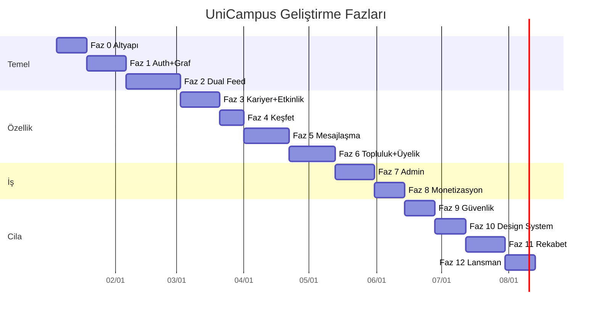

# 08 — Geliştirme Yol Haritası

13 fazlık plan (Faz 0–12). Tahmini süre: ~28–30 hafta (1 full-stack + 1 mobile dev). Her faz çalışan, demo edilebilir bir artımla biter.

## Uygulama Durumu (güncel)

Tüm fazlar (Faz 0–12) kodlandı. Monorepo `typecheck` + `build` tüm paketlerde yeşil; API test paketi geçer.

| Faz | Durum | Notlar |
|-----|-------|--------|
| 0–10 | ✅ Tamam | Altyapı, auth, dual feed, kariyer, keşfet, mesajlaşma, topluluk, admin, monetizasyon, güvenlik, design system |
| 11 | ✅ Tamam | Story + Close Friends, Discord rol/kanal izni/thread/pin, WhatsApp disappearing/view-once/durum metni, bağlantı önerisi, proje detay + milestone tebrik |
| 12 | ✅ Tamam | Reels (V2 lite) + sesli kanal stub, `/v1/health/ready` readiness probe, bağımlılıksız yük testi (`npm run load-test -w @unicampus/api`) |

> Mobil tarafta medya yükleme (story/reel/chat) lansman öncesi gerçek yükleyiciyle değiştirilecek örnek URL akışı kullanır. Sesli kanal ve E2E için altyapı uçları hazırdır; gerçek SFU/Signal entegrasyonu pilot sonrası planlanır.

## Öncelik Matrisi

| Öncelik | Özellik grubu | Faz |
|---------|--------------|-----|
| P0 — Olmazsa olmaz | Auth, dual feed, açık/gizli, takip+bağlantı, profil, DM | 0–2, 5 |
| P0 — Unicorn çekirdek | Sosyal/kariyer ayrımı, onboarding tercih, dual pipeline | 1–2 |
| P0 — Güven | Edu doğrulama, RLS, rate limit, şikayet | 0–2 |
| P1 — Kariyer | Proje, milestone, fırsat, kariyer keşfet | 3 |
| P1 — Topluluk/üyelik | Görünürlük matrisi, davet linki, akademik profil | 6 |
| P1 — Gelir | Sponsor, deals, feed ads (sosyal only) | 8 |
| P1 — Rekabet | Story, E2E, design system, roller | 9–11 |
| P2 — Büyüme | Gamification, mentor, Reels, Pro tier | 12+ |

## Faz 0 — Altyapı (2 hafta)

- Monorepo: `apps/mobile`, `apps/admin`, `apps/api`, `packages/*`.
- PostgreSQL + Redis + BullMQ kurulumu (docker-compose).
- Supabase Auth entegrasyonu.
- Üniversite/domain seed data.
- CI/CD (GitHub Actions + EAS + Vercel).
- Temel monitoring (Sentry), design token'ları (`packages/ui`).

**Çıktı:** Çalışan iskelet, "hello world" tüm uygulamalarda, DB migration pipeline.

## Faz 1 — Auth, Profil ve Sosyal Graf (2.5 hafta)

- Welcome, Login, Register 4 adım + onboarding (sosyal/kariyer tercihi).
- Edu OTP doğrulama (domain whitelist + Resend).
- Profil CRUD, açık/gizli hesap, kariyer headline.
- Takip + bağlantı isteği + onay akışı.
- Dual profil sekmesi (sosyal/kariyer).

**Çıktı:** Kullanıcı kayıt olur, profil oluşturur, başkalarını takip/bağlantı kurar.

## Faz 2 — Dual Feed ve Paylaşım (3.5 hafta)

- Sosyal akış (`feed:social`) + Kariyer akış (`feed:career`) — ayrı pipeline.
- Sosyal post oluşturma, beğeni/yorum.
- Üst sekme geçişi (Sosyal | Kariyer).
- Hashtag parse (sosyal only), takip sistemi.
- Dual feed fan-out worker (BullMQ).

**Çıktı:** İki ayrı akış çalışır, sızıntı testleri geçer (unicorn çekirdeği).

## Faz 3 — Kariyer Paylaşım + Etkinlik (2.5 hafta)

- Proje showcase, milestone, fırsat ilanı formları.
- Kariyer keşfet sekmesi.
- Etkinlik CRUD (sosyal evrende), anket.

**Çıktı:** Kariyer içeriği üretilir; etkinlik/anket akışta.

## Faz 4 — Keşfet ve Arama (1.5 hafta)

- Explore grid, Meilisearch entegrasyonu.
- Kulüp/takım profilleri.

**Çıktı:** Kullanıcı/kulüp/hashtag aranır; keşfet çalışır.

## Faz 5 — Mesajlaşma (3 hafta)

- 1:1 chat, grup, medya, read receipt, typing.
- Push notification (Expo + FCM/APNs).

**Çıktı:** WhatsApp seviyesi DM + grup.

## Faz 6 — Topluluklar ve Üyelik (3 hafta)

- Topluluk/kulüp/takım üyelik matrisi (görünürlük + katılım modu).
- Açık keşfet + gizli davet linki.
- Admin üye yönetimi, onay kuyruğu, rol atama.
- Kanal/grup CRUD, kanal mesajlaşma.
- Akademik profil alanları + alan bazlı gizlilik.

**Çıktı:** Discord benzeri topluluklar + esnek üyelik.

## Faz 7 — Admin Panel (2.5 hafta)

- Next.js admin dashboard.
- Kullanıcı yönetimi (listele, ban, onay).
- İçerik moderasyonu kuyruğu.
- Admin auth + 2FA + audit log.

**Çıktı:** Platform yönetilebilir.

## Faz 8 — Monetizasyon (2 hafta)

- Sponsor CRUD + sözleşme yönetimi.
- Deals/Kampanya yönetimi (admin) → mobil İndirimler sayfası.
- Feed reklam kampanyaları (admin) → akışa enjeksiyon (sosyal only).
- Gelir analitik dashboard + click/impression tracking pipeline.

**Çıktı:** Gelir kanalları çalışır.

## Faz 9 — Güvenlik ve Trust & Safety (2 hafta)

- E2E şifreleme (1:1 DM, libsignal).
- 2FA (kullanıcı + admin zorunlu), biyometrik kilit.
- Gizlilik ayarları ekranı, cihaz/oturum yönetimi.
- Otomatik içerik moderasyonu (metin + görsel).
- Rate limiting, yeni hesap kısıtlamaları, şikayet/appeal akışı.

**Çıktı:** Enterprise güvenlik katmanı.

## Faz 10 — Design System ve UX Cila (2 hafta)

- `packages/ui` design system (40+ komponent).
- Skeleton loader, optimistic UI, haptic feedback.
- Dark mode, FlashList performans, BlurHash görseller.
- Onboarding tour, empty state'ler, animasyonlar.
- Kampüs diferansiyatörleri: sınav countdown, kayıp eşya post tipi.

**Çıktı:** Devlerle eşdeğer UI kalitesi.

## Faz 11 — Rekabetçi Özellikler (2.5 hafta)

- Story + Close Friends.
- Discord: rol sistemi, kanal izinleri, thread, pin.
- WhatsApp: disappearing messages, view-once, durum metni.
- Kariyer: proje detay, milestone tebrik, bağlantı öneri algoritması.

**Çıktı:** Özellik paritesi + diferansiyatörler.

## Faz 12 — Lansman (2 hafta)

- Reels (V2 lite), sesli kanal hazırlığı.
- Pentest + güvenlik audit.
- Load test (10K eşzamanlı feed, 5K eşzamanlı chat).
- App Store / Play Store submit.
- Bug bounty programı duyurusu.

**Çıktı:** Pilot üniversitede canlı.

## Zaman Çizelgesi (Gantt)

## Riskler ve Kararlar

| Risk | Çözüm |
|------|-------|
| Sahte edu mail | Domain whitelist + OTP zorunlu |
| Kulüp hesabı suistimali | Admin onay akışı |
| Milyon kullanıcı DB baskısı | `university_id` partition + replica + Redis cache |
| Feed yavaşlığı | Fan-out on write + celebrity hybrid |
| Mesajlaşma ölçeklenme | Supabase RT → Centrifugo cluster |
| Reklam yorgunluğu | Max 1/5 post, "İlgilenmiyorum" |
| KVKK uyum | Sponsorlu etiket, gizlilik, veri minimizasyonu |
| Admin güvenliği | 2FA, audit log, role-based, ayrı JWT |
| Sosyal/kariyer karışımı | `content_domain` constraint + ayrı Redis key + CI testi |
| Devlerle rekabet | Dual evren + edu güven + kampüs ağı |

## Pilot Stratejisi

İlk üniversite: İTÜ veya ODTÜ (net domain, güçlü kulüp ekosistemi). Tek üniversitede yoğunlaş → network effect → domain listesi genişlet → bölgesel → ulusal. North Star: WCE (bkz. [01](./01-product-vision.md)).
