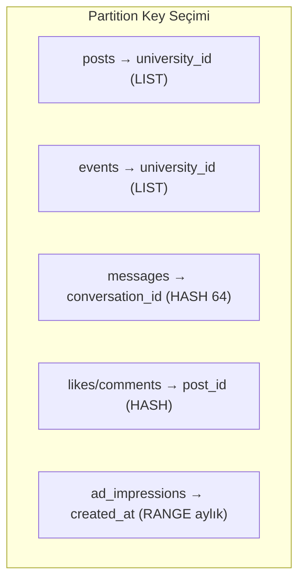
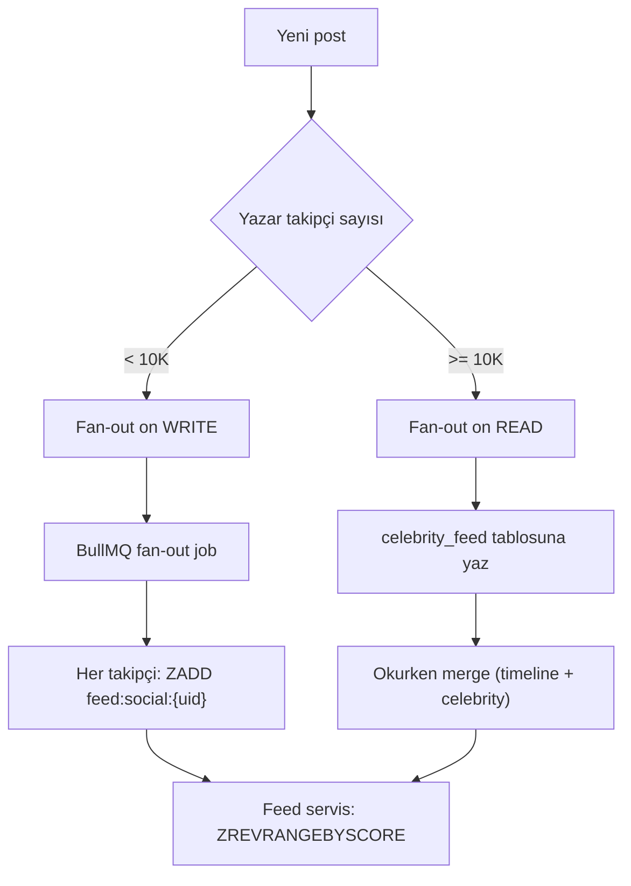
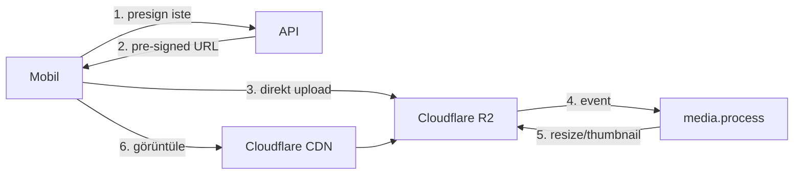
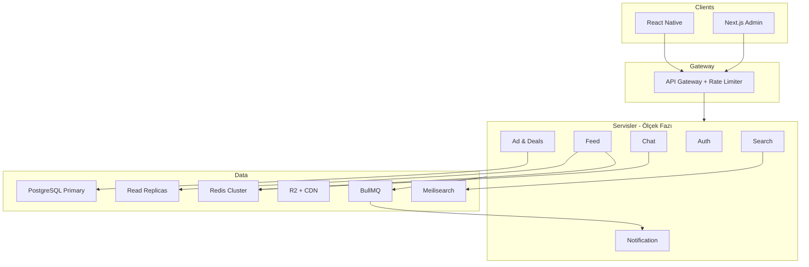

# 09 — Ölçeklenebilirlik Mimarisi

Tasarım ilkesi: **MVP'de hızlı başla, büyüdükçe parçala.** Tek kod tabanı ve veri modeli milyon kullanıcıya hazır; altyapı evrimle ölçeklenir. API contract'ları sabit kalır — istemci değişikliği gerekmez.

## Ölçek Evrim Yol Haritası

| Aşama | Kullanıcı | Altyapı | Ana darboğaz |
|-------|-----------|---------|--------------|
| Pilot | 0–50K | Supabase + Redis + tek API | Yok (rahat) |
| Büyüme | 50K–500K | Read replica, feed worker, CDN, Meilisearch cluster | Feed okuma, medya |
| Ölçek | 500K–2M+ | Dedicated API (K8s), mesaj servisi ayrımı, DB partition | Feed yazma, chat |
| Kurumsal | 2M+ | Multi-region, event bus, Citus/sharding, chat cluster | Global dağıtım |

## Partitioning Stratejisi

Birincil partition key: **`university_id`** — her üniversite doğal bir tenant. Milyon kullanıcı = yüzlerce üniversite × on binlerce öğrenci. Sorguların çoğu tek üniversite içinde kalır (izolasyon = doğal sharding).



| Tablo | Partition | Gerekçe |
|-------|-----------|---------|
| `posts`, `events`, `hashtags` | LIST `university_id` | Sorgular üniversite içinde; sıcak üniversite izole |
| `messages` | HASH `conversation_id` (64) | Cross-uni DM nadir; konuşma bütünlüğü |
| `likes`, `comments` | HASH `post_id` | Hot post yükünü dağıtır |
| `ad_impressions` | RANGE `created_at` (aylık) | Zaman serisi; eski partition arşivlenir |
| `users` | Partition yok + global `username` unique | Arama global olmalı |

> Pilotta partition yok (tek tablo). Ölçek fazında `pg_partman` veya manuel partition'a geçilir; veri taşıma online yapılır.

## Feed Ölçekleme (Hibrit Fan-out)



| Takipçi | Strateji | Maliyet |
|---------|----------|---------|
| < 10K | Fan-out on write — post'u takipçi timeline'larına yaz | Yazma O(takipçi) |
| ≥ 10K | Fan-out on read — celebrity feed'e yaz, okurken merge | Okuma maliyeti |
| Reklam | Feed builder slot pozisyonlarına enjekte | — |

```
Redis Timeline (kullanıcı başına):
  ZADD feed:social:{user_id} {timestamp} {post_id}
  ZADD feed:career:{user_id} {timestamp} {post_id}   # AYRI key
  TTL: 7 gün sliding window
  Okuma: ZREVRANGEBYSCORE (cursor-based)
```

Dual feed kritik kural: `feed:social` ve `feed:career` **ayrı Redis key**. Fan-out worker post'un `content_domain`'ine göre doğru key'e yazar. Sosyal/kariyer sızıntısı imkansız.

### Feed API Akışı

1. Redis'ten kişisel timeline çek (cache hit ~%90).
2. Miss → PostgreSQL'den rebuild + cache warm.
3. (Sosyal akışsa) Ad service'ten aktif reklamları al, slot pozisyonlarına yerleştir.
4. İstemciye birleşik `FeedItem[]` (`type: post | ad | event | poll`).

## Mesajlaşma Ölçekleme

| Aşama | Çözüm |
|-------|-------|
| MVP | Supabase Realtime + PostgreSQL |
| 100K+ aktif chat | Dedicated WebSocket cluster (Centrifugo / Socket.io) |
| 1M+ | Messages ayrı DB (partitioned PG veya ScyllaDB) |

- Presence (online/yazıyor) → Redis Pub/Sub.
- Medya → R2 direkt upload (pre-signed URL); DB'de yalnızca metadata.
- Grup: conversation shard; max 256 üye (MVP) → 10K (scale).

## Cache Katmanı (Redis)

| Key | Amaç | TTL |
|-----|------|-----|
| `feed:social:{user_id}` | Sosyal timeline | 7 gün |
| `feed:career:{user_id}` | Kariyer timeline | 7 gün |
| `trending:{university_id}` | Trend hashtag | 5 dk |
| `user:{id}:profile` | Profil cache | 15 dk |
| `ad:campaigns:active` | Aktif reklamlar | 1 dk |
| `deals:{university_id}` | Aktif kampanyalar | 5 dk |
| `presence:{user_id}` | Online durumu | 30 sn |
| `rate:{user}:{endpoint}` | Rate limit | 1 dk |

Cache invalidation: admin deals/ads değişikliği → ilgili key INVALIDATE. Profil güncellemesi → `user:{id}:profile` sil.

## Async Job Queue (BullMQ)

Tüm ağır işler asenkron — istek yolu hızlı kalır:

| Job | Tetikleyici | Öncelik |
|-----|-------------|---------|
| `feed.fanout` | Post oluşturma | Yüksek |
| `push.batch` | Bildirim | Orta |
| `media.process` | Upload | Orta |
| `trend.calc` | Cron 5 dk | Düşük |
| `email.otp` | Kayıt/giriş | Yüksek |
| `analytics.flush` | Event buffer | Düşük |
| `ads.aggregate` | Impression/click | Orta (idempotent) |
| `search.index` | users/communities CDC | Düşük |

## CDN ve Medya



- Upload API'yi bypass eder (ölçeklenir, API yükü yok).
- Image resize: Cloudflare Images / imgproxy worker.
- Video (V2): Mux veya AWS MediaConvert.
- BlurHash placeholder DB'de saklanır → anında görsel iskeleti.

## Tam Sistem Mimarisi (Hedef)



MVP'de tüm servisler tek `apps/api` (Fastify) monolith. Trafik arttıkça modüller bağımsız servise bölünür — **aynı API contract korunur**, istemci fark etmez.

## Veritabanı Ölçekleme Sırası

1. **İndeksler** (her şeyden önce) — bkz. [04 — Şema](./04-database-schema.md).
2. **Connection pooling** — PgBouncer (transaction mode).
3. **Read replica** — okuma ağırlıklı sorgular (feed, profil) replica'ya.
4. **Materialized view** — trending, analytics.
5. **Partition** — `university_id` LIST, `messages` HASH.
6. **Sharding** — Citus (üniversite bazlı dağıtım) veya servis bazlı ayrı DB.

## SLO Hedefleri

| Metrik | Hedef |
|--------|-------|
| Feed p95 latency | < 200ms (cache hit) |
| Mesaj teslim | < 500ms |
| API uptime | %99.9 |
| Push gecikme | < 5s |
| Eşzamanlı feed (load test) | 10K |
| Eşzamanlı chat (load test) | 5K |

## Maliyet Optimizasyonu

- Sıcak veri Redis, soğuk veri PG, arşiv R2.
- `ad_impressions` aylık partition → eski aylar ucuz depolamaya.
- Görsel boyutları CDN'de türetilir (orijinali bir kez sakla).
- Read replica yalnızca büyüme fazında (erken optimize etme).

## Riskler ve Çözümler

| Risk | Çözüm |
|------|-------|
| Hot post (viral) | `likes`/`comments` post_id hash partition + sayaç Redis'te |
| Celebrity fan-out maliyeti | ≥10K takipçide read-time merge |
| Trend hesap yükü | Cron + materialized + Redis cache |
| DB connection tükenmesi | PgBouncer + connection limit |
| Gelir event kaybı | Idempotent + BullMQ retry + dead-letter queue |
| Sosyal/kariyer karışımı (ölçekte) | Ayrı Redis key + `content_domain` zorunlu filtre |
