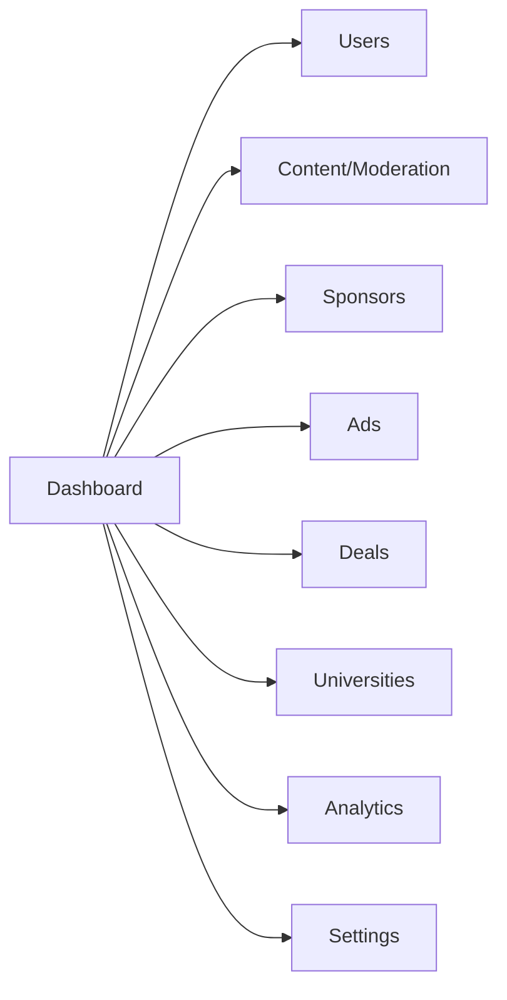
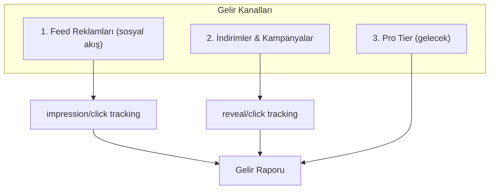
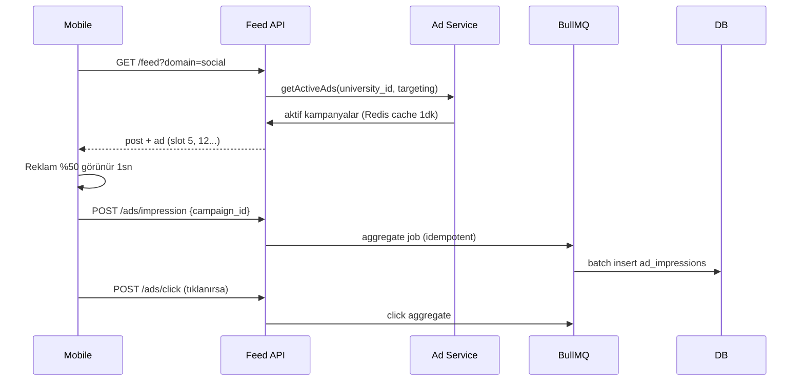
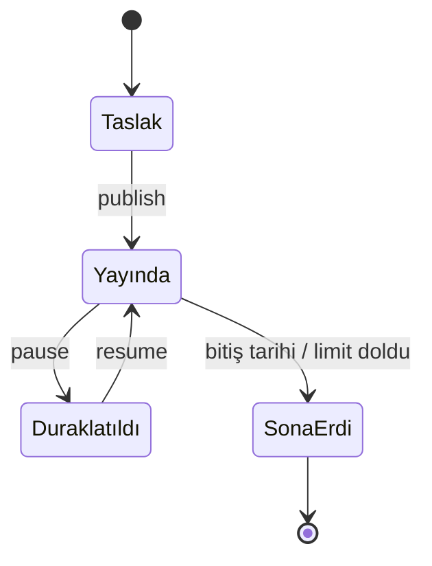

# 10 — Admin Panel & Monetizasyon

Admin paneli platform yönetiminin ve gelirin merkezi. URL: `admin.unicampus.app`. Erişim yalnızca `role in (moderator, admin, super_admin)` — ayrı login (email + şifre + zorunlu 2FA).

## Admin Navigasyon



## Roller ve Yetkiler

| Rol | Yetki |
|-----|-------|
| Moderator | İçerik moderasyonu, kullanıcı uyar/ban |
| Admin | + Sponsor, kampanya, reklam yönetimi, analitik |
| Super Admin | + Üniversite ekleme, admin rol atama, sistem ayarları |

Tüm admin aksiyonları `admin_audit_log`'a immutable yazılır. Detay: [11 — Güvenlik](./11-security-trust-safety.md).

## Modül Özeti

| Modül | Spec |
|-------|------|
| Dashboard | [03/admin/dashboard.md](./03-page-specs/admin/dashboard.md) |
| Kullanıcı yönetimi | [03/admin/users.md](./03-page-specs/admin/users.md) |
| Sponsor yönetimi | [03/admin/sponsors.md](./03-page-specs/admin/sponsors.md) |
| Kampanya (deals) | [03/admin/deals.md](./03-page-specs/admin/deals.md) |
| Feed reklam | [03/admin/ads.md](./03-page-specs/admin/ads.md) |
| Analitik | [03/admin/analytics.md](./03-page-specs/admin/analytics.md) |

---

## Monetizasyon Modeli

İki ana gelir kanalı + gelecekte Pro tier:



### Kanal 1 — Feed Reklamları (Instagram tarzı)

- Native sponsorlu post, **yalnızca sosyal akışta** (kariyer akışı reklamsız — denge korunur).
- Admin reklam kampanyası oluşturur → feed builder slot pozisyonlarına enjekte eder.
- Hedefleme: üniversite, bölüm, sınıf.
- "Sponsorlu" etiketi zorunlu (yasal uyum).

### Kanal 2 — İndirimler & Kampanyalar (Deals)

- Sponsor anlaşmaları → öğrenci indirim kodları.
- Mobil "İndirimler & Fırsatlar" sayfasında listelenir.
- Kod görüntüleme (reveal) ve mağaza tıklama (click) attribution ile takip.

## Gelir Modelleri (Sözleşme Tipleri)

| Model | Tanım | Tetikleyici tablo |
|-------|-------|-------------------|
| CPA | Aksiyon (kod kullanımı) başına | `deal_redemptions` |
| CPC | Tıklama başına | `deal_clicks` / `ad_clicks` |
| CPM | Bin gösterim başına | `ad_impressions` |
| Sabit | Aylık/yıllık sponsorluk | `sponsor_contracts` |
| Hybrid | Sabit + performans bonusu | İkisi birden |

## Reklam Servis Akışı (Teknik)



Idempotency: impression/click event'leri `Idempotency-Key` ile tekrarı engellenir; gelir sayımı bozulmaz.

## Kampanya Yaşam Döngüsü



| Geçiş | Mobil etki | Teknik |
|-------|------------|--------|
| publish | Deals/feed'de görünür | `INVALIDATE deals:{uni}` / `ad:campaigns:active` |
| pause | Anında gizlenir | Cache invalidate |
| limit doldu | "Kampanya sona erdi" | `used_count >= usage_limit` |

## Gelir Hesaplama Pipeline

```
Gerçek zamanlı:  Redis sayaçlar (impression/click counter)
Kalıcı:          BullMQ batch → PostgreSQL (ad_impressions, deal_redemptions)
Raporlama:       Materialized view (günlük rollup) → admin analitik
```

| Gelir | Formül |
|-------|--------|
| Reklam (CPM) | `COUNT(ad_impressions) / 1000 × CPM_rate` |
| Reklam (CPC) | `COUNT(ad_clicks) × CPC_rate` |
| Deal (CPA) | `COUNT(deal_redemptions) × CPA_rate` |
| Sabit | `sponsor_contracts.amount` (dönemsel) |

## Hedefleme (Targeting)

`ad_campaigns.targeting` JSONB:

```json
{
  "universities": ["itu-uuid"],
  "departments": ["Bilgisayar Mühendisliği"],
  "class_years": [3, 4],
  "account_types": ["student"]
}
```

Boş alan = kısıtsız. Feed builder kullanıcı profiline göre eşleşen kampanyaları filtreler.

## Reklam Yorgunluğu Önleme

| Kural | Değer |
|-------|-------|
| Maksimum reklam yoğunluğu | 1 reklam / 5 post |
| "İlgilenmiyorum" feedback | Frekansı düşürür |
| Aynı reklam tekrarı | Oturum başına sınır |
| Kariyer akışı | Reklam yok (temiz deneyim) |

## Yasal Uyum

- "Sponsorlu" / "Reklam" etiketi her reklam kartında zorunlu.
- Kullanıcı reklam tercihleri ayarı (kişiselleştirme opt-out).
- KVKK: hedefleme verisi minimum, açık rıza. Detay: [11 — Güvenlik](./11-security-trust-safety.md).

## Pro Tier (Gelecek Gelir)

| Tier | Özellikler | Fiyat |
|------|-----------|-------|
| Free | Tüm temel özellikler | ₺0 |
| UniCampus Pro | Gelişmiş insights, özel emoji, profil teması, reklamsız | ₺29/ay |
| Kulüp Pro | Analytics, broadcast, öne çıkan etkinlik, verified badge | ₺199/ay |

## Gelir Riskleri

| Risk | Çözüm |
|------|-------|
| Event kaybı/çift sayım | Idempotent event + BullMQ retry + dead-letter |
| Reklam denge bozulması | Kariyer akışı reklamsız, sosyal max 1/5 |
| Sponsor tıklama sahtekarlığı | IP/device rate limit, bot tespiti |
| Kampanya bütçe aşımı | Günlük limit + gerçek zamanlı sayaç kontrolü |
