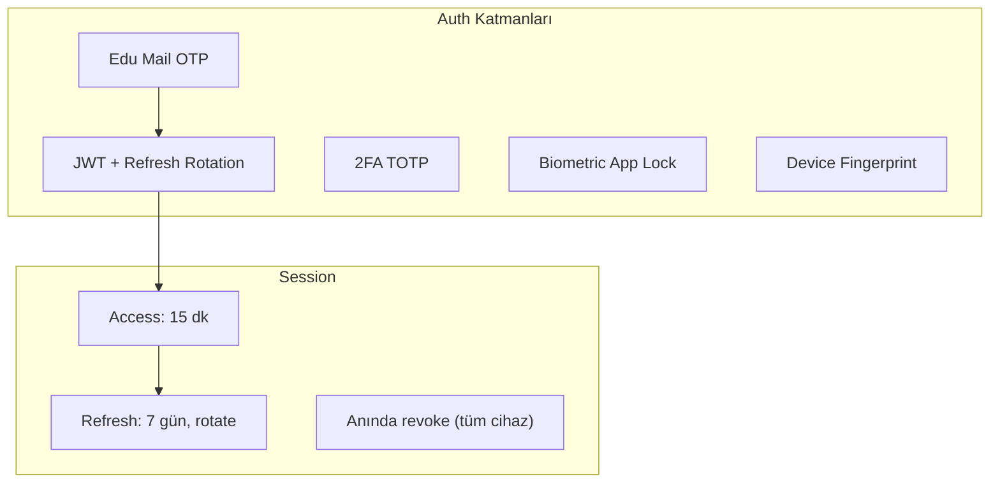
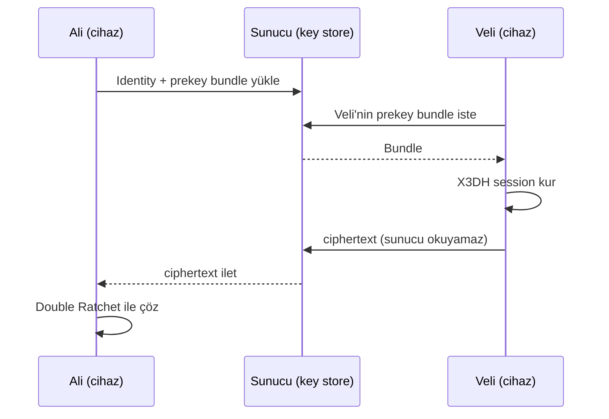
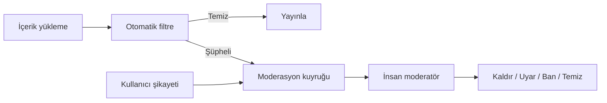
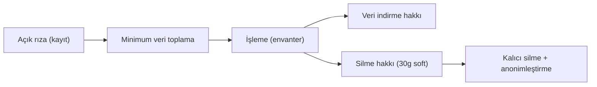

# 11 — Güvenlik ve Trust & Safety

Discord ve Instagram'ın güven altyapısıyla yarışmak için güvenlik **özellik değil, mimari katman**. İlgili kod: `packages/crypto/`, `apps/api/src/middleware/`, RLS policy'leri.

## Kimlik ve Erişim Güvenliği

| Özellik | Detay |
|---------|-------|
| Edu doğrulama | Domain whitelist + OTP + yıllık re-verification |
| 2FA (kullanıcı) | TOTP — opsiyonel; kulüp/takımda zorunlu |
| Biyometrik kilit | Face ID / parmak izi (ayarlanabilir) |
| Cihaz yönetimi | "Aktif oturumlar": cihaz, konum, son aktivite, uzaktan çıkış |
| JWT rotation | Refresh her kullanımda yenilenir, eski invalidate |
| Brute force | Login 5 deneme → 15 dk kilit; OTP 3 deneme → yeni kod |
| Admin 2FA | Zorunlu TOTP + opsiyonel IP whitelist |

### Token Saklama (İstemci)

- Mobil: access token bellekte; refresh token `expo-secure-store` (Keychain/Keystore).
- OTP sunucuda `OTP_PEPPER` ile hash'lenir; düz metin asla.
- Şifreler: Argon2id hash.

## Mesaj ve Veri Şifreleme

| Veri | Koruma |
|------|--------|
| DM (E2E) | Signal Protocol (libsignal) — sunucu içeriği okuyamaz |
| Grup mesaj | Sender Keys (WhatsApp modeli) — V1.5 |
| Medya | Client-side encrypt → R2 (şifreli blob) |
| Transit | TLS 1.3 zorunlu + certificate pinning (mobil) |
| At rest | PostgreSQL TDE + R2/S3 SSE-KMS |
| Hassas alanlar | Email, telefon, öğrenci no → AES-256 application-level |
| Backup | E2E sohbetler cloud backup'a dahil değil (opt-in) |

### E2E Akışı (Signal Protocol)

`packages/crypto` libsignal wrapper'ı sağlar: anahtar üretimi, session yönetimi, encrypt/decrypt. Sunucu yalnızca prekey bundle ve ciphertext taşır.

**E2E göstergesi (UI):** Kilit ikonu + "Uçtan uca şifreli" banner (WhatsApp modeli).

## Gizlilik Kontrolleri

Kullanıcı Ayarları → Gizlilik:

| Kontrol | Seçenekler |
|---------|-----------|
| Profil görünürlüğü | Herkes / Sadece üniversitem / Sadece takipçiler |
| DM izni | Herkes / Takip ettiklerim / Kimse |
| Online durumu | Göster / Gizle / Yakın arkadaşlar |
| Son görülme | Göster / Gizle |
| Etiketleme | Herkes / Takip ettiklerim / Onay gerekli |
| Hikaye | Herkes / Yakın arkadaşlar / Özel liste |
| Arama motoru | Bulunabilir / Bulunma |
| Akademik alanlar | Alan bazlı: Herkes/Bağlantılar/Gizli |
| Veri indirme | KVKK — JSON export (72 saat içinde) |
| Hesap silme | 30 gün soft delete → kalıcı |

## Trust & Safety (İçerik Güvenliği)

| Katman | Teknoloji |
|--------|-----------|
| Metin filtresi | Küfür/nefret listesi + regex (TR/EN) |
| Görsel moderasyon | AWS Rekognition / Google Vision (NSFW, şiddet) |
| Spam tespiti | Rate limit + davranış analizi (aynı link 10+) |
| Bot tespiti | Device fingerprint, hCaptcha, davranış skoru |
| Şikayet | 1 tık: spam, taciz, sahte hesap, uygunsuz, nefret |
| Shadowban | Spam hesaba sessiz kısıtlama (kullanıcı fark etmez) |
| Appeal | Ban'a 1 kez itiraz (admin kuyruğu) |
| ML moderasyon (V2) | Perspective API / custom model |

## Anti-Abuse ve Rate Limiting

| Endpoint | Limit |
|----------|-------|
| Post oluşturma | 10/saat, 50/gün |
| DM gönderme | 60/dk (yeni hesap: 20/dk) |
| Takip | 100/gün |
| OTP | 3/saat per email |
| API genel | 100 req/dk per user + Cloudflare DDoS |
| Report | 20/gün (kötüye kullanım engeli) |

**Yeni hesap kısıtlaması (Instagram modeli):** İlk 48 saat — link paylaşımı, toplu DM, yüksek frekanslı post kısıtlı.

## Üniversite İzolasyonu (RLS)

Mobil kullanıcı yalnızca kendi üniversitesinin verisini görür — RLS ile DB seviyesinde garanti. JWT claim `university_id` her sorguda uygulanır. Admin API ayrı service role kullanır. Detay: [04 — Şema RLS](./04-database-schema.md).

## Uyumluluk ve Hukuk

| Gereksinim | Uygulama |
|------------|----------|
| KVKK | Açık rıza, veri işleme envanteri, DPO, silme hakkı |
| GDPR (genişleme) | Cookie/tracking consent, data portability |
| Reklam yasal | "Sponsorlu" etiket zorunlu, reklam tercihleri |
| Yaş | Üniversite öğrencisi (edu mail yeterli doğrulama) |
| Audit log | Tüm admin aksiyonları immutable |
| Pentest | Lansman öncesi 3. parti |
| Bug bounty (V2) | HackerOne benzeri |

### KVKK Veri Akışı

DM içeriği admin'e gösterilmez (E2E zaten okunamaz; metadata yalnız gerekli). Veri minimizasyonu: öğrenci no API'de düz dönmez.

## Güvenlik UI Elemanları (Kullanıcıya Görünür)

- Profilde **Doğrulanmış Öğrenci** mavi tik (edu onaylı).
- Kulüp/Takım'da **Onaylı Kurum** altın tik.
- E2E sohbette kilit ikonu + banner.
- Şüpheli link uyarısı.
- "Bu hesap yeni oluşturuldu" uyarısı (DM).
- Güvenlik merkezi: 2FA, oturumlar, engellenenler, veri indirme.

## Admin Güvenliği

- Ayrı admin login + zorunlu 2FA (TOTP).
- Admin JWT ayrı secret + kısa ömür + ayrı rate-limit bucket.
- `admin_audit_log` immutable (UPDATE/DELETE engelli).
- Opsiyonel IP whitelist (production).
- Role-based access: moderator < admin < super_admin.

## Güvenlik Test Stratejisi

| Test | Faz |
|------|-----|
| Dependency audit (npm audit, Snyk) | CI'da sürekli |
| SAST (CodeQL) | CI'da |
| Secrets tarama (gitleaks) | CI'da |
| RLS policy testleri | Faz 1+ |
| Pentest (3. parti) | Lansman öncesi (Faz 12) |
| Load + fuzz | Lansman öncesi |

## Olay Müdahale (Incident Response)

1. Tespit (Sentry alarm, anomali).
2. İzole (etkilenen oturum/hesap revoke).
3. Değerlendirme (audit log analizi).
4. İletişim (KVKK ihlali → 72 saat bildirim yükümlülüğü).
5. Düzeltme + post-mortem.
