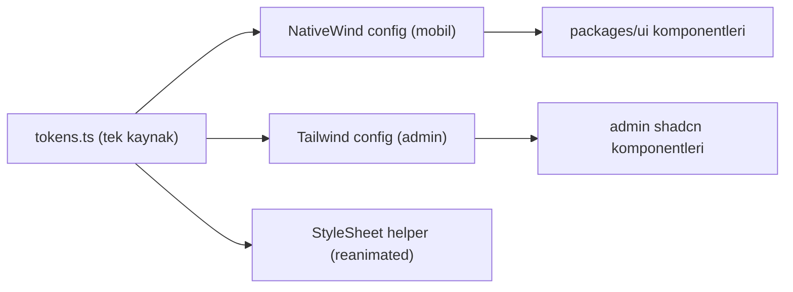

# 12 — Design System

Instagram ve Discord kalitesinde arayüz için **baştan design system** — sonradan yapıştırılmaz. İlgili kod: `packages/ui/`. Token'lar tek doğruluk kaynağı; mobil (NativeWind) ve admin (Tailwind/shadcn) aynı token setini paylaşır.

## Tasarım Felsefesi

| İlke | Uygulama |
|------|----------|
| Tutarlılık | Tek token seti, tüm ekranlarda aynı spacing/radius/shadow |
| Hız hissi | Skeleton loader, optimistic UI, 60fps animasyon |
| Derinlik | Subtle shadow + elevation (Material 3 / iOS HIG uyumlu) |
| Boşluk | Generous whitespace — nefes alan layout |
| Mikro-etkileşim | Her aksiyonda haptic + spring animasyon |

## Design Token'ları

### Renkler

```
primary:       #5B4FE8   (indigo — güven + gençlik)
primary-dark:  #4338CA
accent:        #F59E0B   (kampanya/etkinlik vurgusu)
success:       #10B981
danger:        #EF4444
warning:       #F59E0B
info:          #3B82F6

# Light / Dark çiftleri
surface:       #FFFFFF / #0F0F0F
surface-2:     #F8F9FA / #1A1A1A
border:        #E5E7EB / #2D2D2D
text-primary:  #111827 / #F9FAFB
text-muted:    #6B7280 / #9CA3AF
```

### Spacing (4px grid)

```
4, 8, 12, 16, 24, 32, 48, 64
```

### Radius

```
sm=8  md=12  lg=16  xl=24  full=9999
```

### Shadow / Elevation

```
elevation-1   kart
elevation-2   yüzen kart
elevation-3   bottom sheet
elevation-4   modal
elevation-5   FAB
```

### Tipografi

Font: Inter (Android/web), SF Pro (iOS fallback).

```
heading-xl: 28/34 bold
heading-lg: 22/28 semibold
heading-md: 18/24 semibold
body:       16/24 regular
caption:    13/18 medium
micro:      11/16 medium
```

### Token Uygulaması

```ts
// packages/ui/src/tokens.ts (öneri)
export const tokens = {
  color: { primary: '#5B4FE8', /* ... */ },
  space: [4, 8, 12, 16, 24, 32, 48, 64],
  radius: { sm: 8, md: 12, lg: 16, xl: 24, full: 9999 },
  font: { /* ... */ },
} as const;
```

NativeWind `tailwind.config` ve admin Tailwind config bu token dosyasından türetilir — tek kaynak.

## Komponent Kütüphanesi (40+ core)

| Kategori | Komponentler |
|----------|-------------|
| Navigation | TabBar (custom, ortada FAB), TopBar, BottomSheet, Drawer |
| Feed | PostCard, EventCard, PollCard, AdCard, StoryRing, TrendChip, ProjectCard, MilestoneCard, OpportunityCard |
| Sosyal graf | FollowButton, ConnectButton, ConnectionRequestSheet, PrivacyBadge |
| Üyelik | JoinButton, MembershipRequestSheet, InviteLinkSheet, MemberRoleBadge |
| Akademik | AcademicInfoCard, FieldVisibilityToggle, GPABadge |
| Etkileşim | LikeButton (lottie kalp), CommentSheet, ShareSheet, ReactionBar |
| Form | Input, OTPInput, Select, DatePicker, ImagePicker, RichTextEditor |
| Chat | MessageBubble, ChatInput, VoiceRecorder, MediaPreview, TypingIndicator |
| Profil | Avatar (rozet destekli), StatsRow, GridGallery |
| Feedback | Toast, Snackbar, EmptyState, ErrorState, Skeleton, PullToRefresh |
| Güven | VerifiedBadge, SponsorLabel, ReportSheet |

Teknoloji: React Native + NativeWind v4 + `react-native-reanimated` + `lottie-react-native`.

### Komponent API Örneği

```tsx
// FollowButton — durum makinesine bağlı
<FollowButton
  targetId={user.id}
  state="not_following | pending | following"
  isPrivate={user.account_visibility === 'private'}
  onPress={handleFollow}
/>
```

## Ekran Kalite Standartları (Devlerle Eşdeğer)

| Standart | Hedef |
|----------|-------|
| İlk render | < 300ms (skeleton) |
| Feed scroll | 60fps, FlashList recycling |
| Görsel yükleme | BlurHash → progressive JPEG |
| Animasyon | reanimated spring + layout animasyonları |
| Gesture | Swipe-back, pull-to-refresh, double-tap like, long-press menu |
| Haptic | Beğeni, gönder, hata, başarı (expo-haptics) |
| Dark mode | Sistem + manuel, tüm token'lar dual-theme |
| Tablet | Responsive (2 sütun feed, sidebar chat) |
| Offline | Son feed cache, draft post, queued mesaj |
| i18n | TR + EN (i18next) |

## Sayfa Bazlı UI Referansları

```
Akış:       Instagram feed + Twitter trend şeridi
Story:      Instagram story (tap left/right, progress bar)
Post detay: Threads yorum UI + Instagram beğeni animasyonu
Chat:       WhatsApp bubble + Telegram reply swipe + Discord emoji react
Topluluk:   Discord sidebar + Slack channel header
Keşfet:     Instagram explore grid + Pinterest masonry
Profil:     Instagram profil + LinkedIn rozet alanı
Etkinlik:   Eventbrite kart + Apple Calendar estetiği
Deals:      App Store featured kart + kupon estetiği
Onboarding: Linear/Notion minimal wizard (adım göstergeli)
```

## Mikro-etkileşim Kütüphanesi

| Etkileşim | Davranış |
|-----------|----------|
| Beğeni | Lottie kalp patlama + haptic light |
| Çift tıklama | Büyük kalp overlay + fade |
| Pull-to-refresh | Spring + custom loader |
| Buton basışı | Scale 0.96 + haptic |
| Sayfa geçişi | Shared element / slide |
| Toast | Slide-down + auto-dismiss |
| Skeleton | Shimmer gradient |

## Erişilebilirlik (a11y)

| Gereksinim | Uygulama |
|------------|----------|
| Kontrast | WCAG AA (4.5:1 metin) |
| Dokunma hedefi | Min 44×44pt |
| Screen reader | accessibilityLabel/role tüm interaktif öğelerde |
| Dinamik font | Sistem font ölçeğine saygı |
| Reduce motion | Animasyonları azalt seçeneği |
| Renk bağımsızlığı | Durum yalnız renge bağlı değil (ikon + metin) |
| Klavye (admin) | Tam klavye navigasyonu, focus ring |

## Onboarding ve İlk Deneyim

- Kayıt sonrası 3 adımlı guided tour (swipe tooltip).
- "Takip etmen gereken 5 kulüp" önerisi (üniversiteye özel).
- Boş feed yerine curated starter content (admin seeded).
- Profil tamamlama progress bar (%60 → daha fazla görünürlük).

## Tema Mimarisi



Dark/light: token çiftleri runtime'da `useColorScheme` ile çözülür; tüm komponentler theme-aware.

## Performans Kuralları

- Liste: her zaman `FlashList` (FlatList değil).
- Görsel: `expo-image` + BlurHash + memory/disk cache.
- Animasyon: `reanimated` worklet (JS thread'i bloklamaz).
- Yeniden render: `memo`, stable callback, atomic Zustand selector.
- Lazy: ağır ekranlar (chat, kamera) lazy load.
