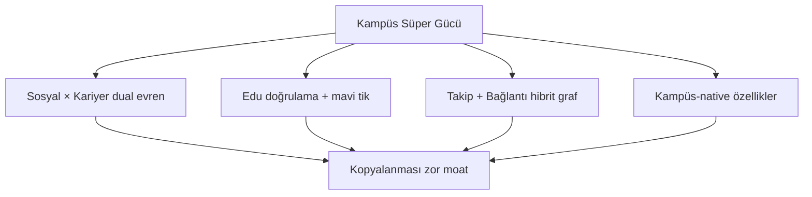

# 13 — Rekabetçi ve Diferansiyatör Özellikler

Strateji: **"kopya + kampüs süper gücü."** Devlerin kanıtlanmış özelliklerini al, kampüs bağlamında benzersizleştir. Öncelik etiketleri faz planıyla ([08 — Roadmap](./08-development-roadmap.md)) eşleşir.

## Instagram'dan — Eklenecekler

| Özellik | Öncelik | Açıklama |
|---------|---------|----------|
| Story | V1 | 24 saat, foto/video, anket/quiz sticker, mention, konum |
| Reels / kısa video | V2 | 60 sn max, müzik overlay, keşfette ayrı sekme |
| Close Friends | V1 | Yakın arkadaş listesi — story/post görünürlüğü |
| Kaydet / Koleksiyon | V1 | Post kaydet, klasörle (sosyal/kariyer/etkinlik) |
| Açık/Gizli hesap | MVP | Takip isteği onayı, profil kısıtlama |
| Bağlantı isteği | MVP | LinkedIn tarzı mutual connect |
| Carousel post | V1 | Çoklu foto swipe |
| Aktivite/bildirim hub | MVP | Beğeni/yorum/takip/mention tek ekran |
| Insights (kulüp/takım) | V1 | Görüntülenme, etkileşim, büyüme grafikleri |
| Link in bio | V1 | Kulüp/takım profili harici link |
| Arşiv | V2 | Post gizle (silmeden) |

## Discord'dan — Eklenecekler

| Özellik | Öncelik | Açıklama |
|---------|---------|----------|
| Rol sistemi | V1 | Admin/Moderator/Üye/Misafir — renkli rol etiketi |
| Kanal izinleri | V1 | Yazma/okuma izni, slow mode |
| Sesli kanal | V2 | Topluluk sesli sohbet (Agora/LiveKit) |
| Thread (konu) | V1 | Kanalda mesaj altına thread |
| Pin mesaj | V1 | Önemli duyuruyu sabitle |
| Bot/webhook | V2 | Kulüp duyuru botu |
| Emoji/Sticker | V1 | Üniversiteye özel emoji paketi |
| Sunucu boost | V3 | Premium topluluk (monetizasyon) |

## WhatsApp/Telegram'dan — Eklenecekler

| Özellik | Öncelik | Açıklama |
|---------|---------|----------|
| E2E şifreleme | V1 | Signal Protocol |
| Disappearing messages | V1 | 24s / 7g / 90g |
| View once media | V1 | Tek görüntülemelik medya |
| Sesli/görüntülü arama | V2 | 1:1 ve grup (Agora) |
| Durum metni | V1 | "Ders çalışıyorum" preset + custom |
| Mesaj arama | V1 | Sohbet içi full-text |
| Sessize al / Sabitle | MVP | Sohbet listesinde |
| Broadcast list | V2 | Kulüp toplu duyuru (DM olarak) |

## Unicorn Diferansiyatörler (Ana Silah — Kopyalanamaz)

| Özellik | Öncelik | Açıklama |
|---------|---------|----------|
| Sosyal × Kariyer dual evren | MVP | İki ayrı feed, sıfır sızıntı — devlerde yok |
| Edu doğrulama + mavi tik | MVP | Güven katmanı — kampüse özel |
| Takip + Bağlantı hibrit graf | MVP | Instagram + LinkedIn tek platformda |
| Proje showcase | V1 | Üniversite projeleri portfolyo |
| Kariyer milestone | V1 | Staj, ödül, sertifika kutlama |
| Sınav geri sayım widget | MVP | Kampüs-native, sosyal akışta hafif widget |
| Kayıp eşya ilanı | V1 | Sosyal post tipi (content_domain=social) |
| Kampüs puanı / gamification | V2 | Etkinlik/bağlantı/proje → rozet, leaderboard |
| Mentor eşleştirme | V2 | Üst sınıf → alt sınıf (kariyer evreni) |
| Çalışma odası eşleştirme | V2 | Geçici topluluk — "birlikte çalışalım" |
| Oda/ev arkadaşı bul | V3 | Housing board (moderasyonlu) |

**Bilinçli kapsam dışı:** Ders notu paylaşımı, interaktif kampüs haritası (odak dağılmasın).

## Sosyal Grafik ve Keşif (Algoritma)

| Özellik | Evren | Açıklama |
|---------|-------|----------|
| "Senin için" kişi | Sosyal | Ortak takip, topluluk, bölüm |
| "Bağlantı öner" | Kariyer | 2. derece, aynı bölüm, ortak proje |
| "Bu hafta kampüste" | Sosyal | Trend etkinlik digest |
| "Kariyer fırsatları" | Kariyer | Staj/proje ilanları digest (ayrı push) |
| Sosyal kanıt | Her ikisi | "12 ortak bağlantı" |
| Yakın arkadaşlar | Sosyal | Close friends story |

## Rakip Karşılaştırma Matrisi

| Özellik | Instagram | LinkedIn | Discord | WhatsApp | UniCampus |
|---------|-----------|----------|---------|----------|-----------|
| Sosyal akış | ✓ | kısmi | — | — | ✓ |
| Kariyer ağı | — | ✓ | — | — | ✓ |
| Topluluk/kanal | kısmi | — | ✓ | grup | ✓ |
| E2E mesaj | — | — | — | ✓ | ✓ |
| Edu doğrulama | — | — | — | — | ✓ |
| Dual evren (ayrım) | — | — | — | — | ✓ |
| Kampüs izolasyonu | — | — | — | — | ✓ |
| Etkinlik + katılım | kısmi | ✓ | ✓ | — | ✓ |

UniCampus'un kazandığı yer: tek bir sütunda değil, **kombinasyonun bütününde**. Hiçbir dev tüm satırları kapsamıyor; öğrenci için tek adres olma fırsatı buradan doğar.

## Premium / Pro Özellikler

Detay: [10 — Monetizasyon](./10-admin-monetization.md). Pro tier diferansiyatörü daha da güçlendirir (reklamsız, insights, özelleştirme) ve ek gelir sağlar.
