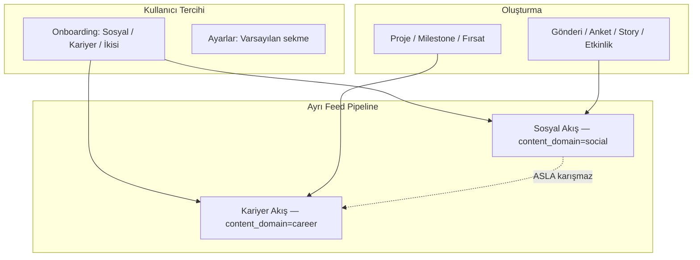
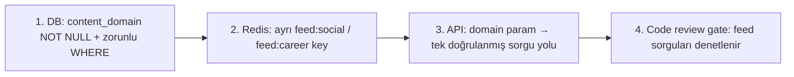
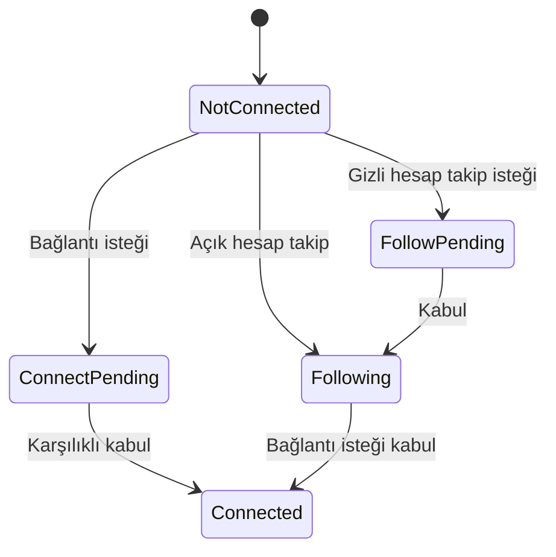

# 14 — Sosyal × Kariyer Ürün Tasarımı

UniCampus'un en kritik ürün kararı ve unicorn farkı: **İki evren, sıfır sızıntı.** Bu doküman dual feed mimarisini, içerik taksonomisini, sosyal graf modelini ve hesap gizliliğini tanımlar.

## Çekirdek İlke



**Altın kural:** `content_domain=social` feed sorgusuna `career` postları **SQL ve Redis seviyesinde** dahil edilmez. Karışım yok, istisna yok.

## İçerik Taksonomisi (Net Sınırlar)

| Domain | İçerik tipleri | Görünür olduğu yer |
|--------|---------------|-------------------|
| social | Gönderi, foto, anket, story, etkinlik, kayıp eşya | Sosyal Akış, Sosyal profil sekmesi, Keşfet (sosyal) |
| career | Proje showcase, kariyer milestone, staj/iş fırsatı, başarı | Kariyer Akış, Kariyer profil sekmesi, Kariyer Keşfet |
| neutral | Etkinlik (kulüp), kulüp duyurusu | Sosyal akışta (etkinlik kartı); kariyer akışında değil |

> `neutral` içerik pratikte sosyal akışta etkinlik kartı olarak görünür; kariyer akışını kirletmez. DB'de `content_domain` yine `social` olarak işaretlenir (etkinlik sosyal bir aktivitedir).

## Sızıntısızlık Garantisi (Teknik)

Üç katmanlı savunma:



| Katman | Mekanizma |
|--------|-----------|
| Veritabanı | `posts.content_domain` zorunlu; feed sorgusu daima `WHERE content_domain = $domain` |
| Cache | `feed:social:{uid}` ve `feed:career:{uid}` ayrı key; fan-out worker domaine göre yazar |
| API | `GET /feed?domain=` tek parametre; yanlış domain item dönmesi imkansız |
| Süreç | Feed builder testleri sızıntıyı assert eder (CI) |

## Kullanıcı Tercihi Modeli

| Ayar | Davranış |
|------|----------|
| Varsayılan sekme: Sosyal | Açılışta Sosyal Akış |
| Varsayılan sekme: Kariyer | Açılışta Kariyer Akış |
| Bildirim ayrımı | Sosyal ve kariyer bildirimleri ayrı toggle |
| Keşfet ayrımı | Keşfet'te Sosyal / Kariyer alt sekmeleri |

Onboarding sorusu (1 tık): *"UniCampus'u en çok ne için kullanacaksın?"* → Sosyal / Kariyer / Her ikisi → `user_preferences.default_feed_tab` + ilk hafta öneri içerik buna göre.

## Sosyal Graf Modeli (Takip + Bağlantı)

İki ayrı ilişki tipi — Instagram ve LinkedIn'i doğru birleştirir:

| İlişki | Model | Açıklama |
|--------|-------|----------|
| Takip (Follow) | Tek yönlü (Instagram) | İçerik tüketimi; açık hesap onaysız, gizli hesap istek |
| Bağlantı (Connect) | Karşılıklı (LinkedIn) | Profesyonel ağ; istek → kabul → mutual |
| Yakın Arkadaş | Özel liste (Instagram CF) | Story + seçili post görünürlüğü |



### İlişkinin Feed'e Etkisi

| İlişki | Sosyal akışı besler | Kariyer akışı besler |
|--------|---------------------|----------------------|
| Takip | ✓ (sosyal postlar) | kısmi (açık kariyer postu) |
| Bağlantı | ✓ | ✓ (öncelikli) |
| Yakın arkadaş | ✓ + close friends story | — |

Kariyer akışı **bağlantı** ilişkisine ağırlık verir (profesyonel ağ); sosyal akış **takip** ilişkisine.

## Hesap Gizliliği (Instagram Modeli)

| | Açık Hesap | Gizli Hesap |
|---|-----------|-------------|
| Profil | Herkes görür | Sadece takipçiler |
| Sosyal postlar | Herkes / takipçi ayarı | Sadece onaylı takipçiler |
| Kariyer postları | Ayrı görünürlük ayarı | Bağlantılar + onaylı takipçiler |
| Takip | Anında | İstek → onay |
| Arama | Bulunabilir | Bulunabilir (profil kısıtlı) |
| Mention | Herkes | Takipçiler |

**Kariyer görünürlüğü ekstra katman:** Kullanıcı sosyal hesabını gizli tutarken kariyer profilini "Bağlantılara açık" yapabilir (LinkedIn mantığı). `users.career_visibility` bağımsız alandır.

## Profil Buton Matrisi

| Durum | Açık hesap | Gizli hesap |
|-------|-----------|-------------|
| İlişki yok | [Takip Et] + [Bağlantı Kur] | [Takip İsteği] + [Bağlantı İsteği] |
| Takip var, bağlantı yok | [Takip Ediliyor ▼] + [Bağlantı Kur] | Aynı |
| Bağlantı var | [Bağlantı ✓] + [Mesaj] | Aynı |

## Kariyer Paylaşım Tipleri

### Proje Paylaşımı (LinkedIn Project benzeri)

```
🚀 PROJE
UniCampus Mobil Uygulama
@ali · Full-stack Dev
React Native · Node.js
[Proje görseli]
Katkı: Backend, UI
🔗 GitHub · Demo
👥 3 bağlantı bu projede
♡ 56  💬 12  ↗ 8
```

Alanlar: başlık, rol, açıklama, tech stack tag'leri, medya, GitHub/demo link, ekip üyeleri (@mention), tarih, görünürlük.

### Kariyer Milestone

- "Google'da stajyer oldum", "Hackathon birinciliği", "Sertifika aldım".
- Kısa metin + opsiyonel görsel + kutlama reaksiyonları ("Tebrik Et").

### Fırsat İlanı (Öğrenci/kulüp)

- "Yazılım ekibine React dev arıyoruz" / "Staj arıyorum".
- Sadece kariyer akışında — sosyal akışa düşmez.
- Admin moderasyonu (spam önleme).

## Feed Algoritmaları (Özet)

### Sosyal

1. `WHERE content_domain = 'social'` (zorunlu).
2. Takip edilenlerin postları (Redis `feed:social`).
3. Üniversite içi yüksek engagement (%20 keşfet).
4. Reklam: her 5–7 postta 1 (sadece sosyal).

### Kariyer

1. `WHERE content_domain = 'career'` (zorunlu).
2. 1. derece bağlantıların postları (öncelik).
3. Aynı bölüm/fakülte kariyer postları.
4. Trend projeler + fırsatlar.
5. Reklam **yok**.

## Neden Bu Ayrım Kazandırır

| Sorun (rakiplerde) | UniCampus çözümü |
|--------------------|------------------|
| LinkedIn'de sosyal gürültü | Kariyer akışı temiz, profesyonel |
| Instagram'da kariyer spam | Sosyal akışta kariyer postu yok |
| Tek feed'de bağlam karmaşası | Kullanıcı evreni seçer, kontrol onda |
| Profesyonel/özel kimlik çatışması | Dual profil + ayrı görünürlük |

Bu denge, hiçbir devin sunmadığı bir kontrol ve netlik sağlar — öğrenci hem eğlenir hem kariyerini inşa eder, ikisi birbirine karışmadan.

## Doğrulama Checklist (Kabul Kriterleri)

- [ ] `domain=social` isteği hiçbir `career` post döndürmez (test).
- [ ] `domain=career` isteğinde hiçbir reklam item bulunmaz (test).
- [ ] Onboarding tercihi `default_feed_tab`'a yazılır.
- [ ] Oluşturma akışı evren seçimini zorunlu kılar (yanlış domaine post imkansız).
- [ ] `career_visibility` `account_visibility`'den bağımsız çalışır.
- [ ] Bildirimler sosyal/kariyer ayrı toggle ile filtrelenir.
