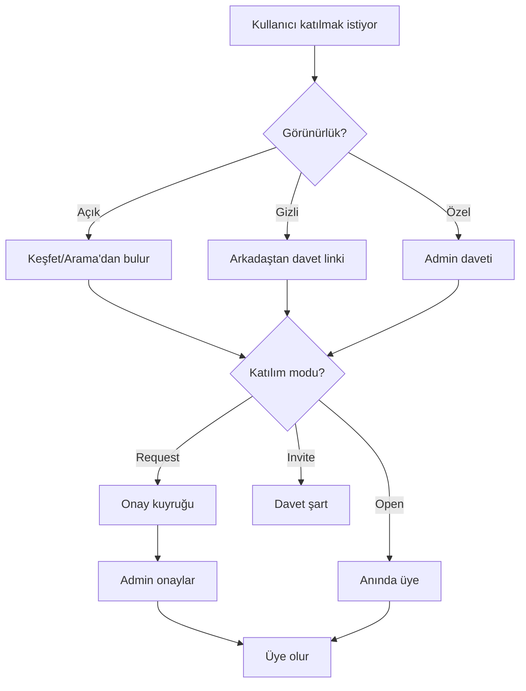
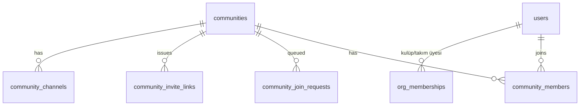

# 15 — Üyelik ve Topluluklar

Kulüp, takım ve kullanıcı toplulukları **tek üyelik modeli** paylaşır. Adminler görünürlük ve katılım kurallarını belirler. İlgili kod: `apps/api/src/services/community/`.

## İki Bağımsız Ayar

Her kulüp/takım/topluluk için iki ortogonal ayar:

### 1. Görünürlük — "Nerede bulunur?"

| Tip | Keşfet/Arama | Davet linki | Profilde listelenir |
|-----|-------------|-------------|---------------------|
| Açık (public) | Evet | Evet | Evet |
| Gizli (unlisted) | Hayır | Evet (tek giriş yolu) | Üye tercihine bağlı |
| Özel (private) | Hayır | Hayır (sadece admin daveti) | Gizlenebilir |

### 2. Katılım Modu — "Nasıl girilir?"

| Mod | Davranış | Buton |
|-----|----------|-------|
| Herkese açık (open) | Anında üye ol | [Katıl] |
| İstekle (request) | Admin onayı gerekir | [Katılım İsteği Gönder] |
| Sadece davet (invite) | Admin/davetli üye davet eder | [Davet Bekleniyor] |

## Katılım Akışı (Birleşik)



## Geçerli Kombinasyonlar (Örnekler)

| Senaryo | Görünürlük + Mod | Sonuç |
|---------|------------------|-------|
| IEEE Kulübü | Açık + İstekle | Keşfette görünür, katılım isteği gerekir |
| Arkadaş grubu | Gizli + Open | Sadece link ile, linke tıklayan anında girer |
| Proje ekibi | Özel + Invite | Sadece lider davet eder |
| Futbol takımı | Açık + İstekle | Aramada bulunur, antrenör onaylar |
| Açık duyuru kanalı | Açık + Open | Herkes anında katılır |

İki ayar bağımsız olduğu için 3×3 = 9 kombinasyon mümkün; ürün bunların hepsini destekler.

## Davet Linki Sistemi (Gizli topluluklar)

```
Davet Linki Oluştur
unicampus.app/join/Xk9mP2nQ
Süre: [7 gün ▼]   Max kullanım: [50]
[Linki Kopyala] [Paylaş]   [Linki İptal Et]
```

| Özellik | Davranış |
|---------|----------|
| Link tıklama | Topluluk önizleme → katılım moduna göre Katıl/İstek |
| Süre | Ayarlanabilir (1g/7g/30g/süresiz) |
| Max kullanım | Sayı limiti (`use_count >= max_uses` → ölü) |
| Yenileme | Admin tek tıkla yeniler (eski link ölür) |
| Güvenlik | Gizli topluluklar search index'ine **asla** girmez |

Token `community_invite_links.token` (kriptografik rastgele). `POST /join/{token}` → doğrulama → üyelik.

## Topluluk Keşfi (Açık olanlar)

```
🔍 Topluluk, kulüp ara...
[Tümü][Kulüp][Takım][Grup]
┌─────────────────────────┐
│ [icon] IEEE Kulübü      │
│ 240 üye · Teknoloji     │
│ Açık · İstekle katıl    │
│ [Katılım İsteği]        │
└─────────────────────────┘
```

Filtreler: kategori, üye sayısı, katılım tipi, üniversite (otomatik). Yalnızca `visibility=public` döner.

## Admin Üye Yönetimi

```
← Üye Yönetimi
Bekleyen istekler (5)
  @ali  [Onayla][Red]
Üyeler (240)
  @ali — Admin
  @veli — Moderator [▼]
  @ayse — Üye [Çıkar]
Ayarlar:
  Görünürlük: [Açık ▼]
  Katılım: [İstekle ▼]
  [Davet linki oluştur]
```

| Aksiyon | Yetki |
|---------|-------|
| İstek onay/red | admin, moderator |
| Rol değiştir | owner, admin |
| Üye çıkar | admin, moderator |
| Görünürlük/mod değiştir | owner, admin |
| Davet linki | admin |
| Topluluk sil | owner |

## Roller

| Rol | Yetki |
|-----|-------|
| Owner | Tüm yetkiler + topluluk silme |
| Admin | Ayarlar, üye yönetimi, kanal CRUD |
| Moderator | Mesaj sil, üye sustur, istek onay |
| Member | Yazma (izin varsa), okuma |

## Discord Kanal Yapısı (topluluk içi)

```
Topluluk: "ITÜ Bilgisayar 2024"
├── # genel
├── # etkinlikler
├── # duyurular (sadece admin yazar)
└── Grup: "Final Çalışma" (max 50 kişi)
```

| | Kanal | Grup |
|---|-------|------|
| Üye | Sınırsız | Max 50 |
| Amaç | Broadcast | Alt sohbet |
| Yazma | Rol/izin bazlı | Tüm grup üyeleri |

**İçerik scope:** Topluluk kanalı paylaşımları ana akışa (sosyal/kariyer) düşmez — sadece topluluk içinde kalır.

## Kulüp ve Takım Üyeliği (hesap tipine özel)

| | Kulüp | Takım |
|---|-------|-------|
| Üye rolleri | Üye, Yönetici, Moderator | Oyuncu, Kaptan, Yedek, Koç |
| Katılım | Aynı matris (görünürlük + mod) | Aynı |
| Profil sekmesi | Üye listesi + rol | Kadro + pozisyon |
| Özel | Çoklu yönetici, etkinlik organize | Maç/takvim duyurusu |

Kulüp/takım hesapları `org_memberships` tablosunu kullanır; kullanıcı toplulukları `community_members`. İkisi de aynı görünürlük + katılım matrisine uyar.

## Üyelik Veri Modeli (Özet)



Detaylı şema: [04 — Veritabanı](./04-database-schema.md).

## Bildirimler

| Olay | Alıcı |
|------|-------|
| Katılım isteği | Admin/moderator |
| Üyelik onaylandı | İstek sahibi |
| Davet linki ile katılım | Admin (bilgi) |
| Role yükseltme | İlgili üye |

## Kabul Kriterleri

- [ ] Gizli/özel topluluk aramada görünmez.
- [ ] Davet linki süre/limit aşımında çalışmaz.
- [ ] İstek modunda admin onayı olmadan üye olunamaz.
- [ ] Davet modunda davet olmadan katılım imkansız.
- [ ] Rol değişiklikleri yalnız yetkili rollerce yapılır.
- [ ] Topluluk içeriği ana akışa sızmaz.
